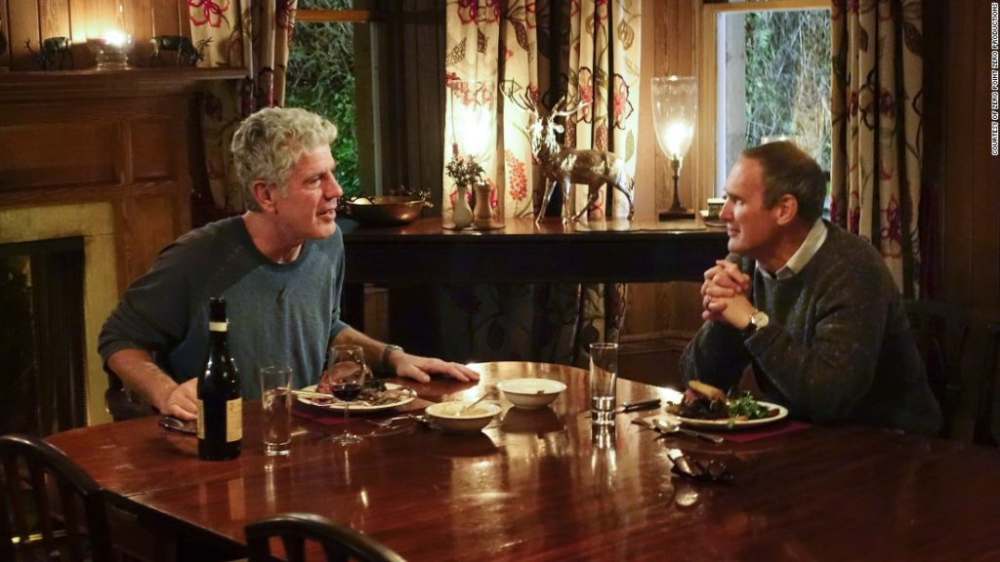

 A scene from Parts Unknown, Scotland episode

I was on the plane yesterday to Hong Kong when I watched Anthony Bourdain’s Parts Less Known documentary. Episode one covered Scotland, Glasgow mostly, where Bourdain spoke to many different kinds of Glaswegians (people of Glasgow).

# Anthony Bourdain

I’ve always found Bourdain to have a quirky but captivating air around the way he hosts. He often looks simultaneously unhappy and pleased at the same time and occasionally switching it up. Perhaps that’s a prerequisite to keep an audience engaged? To keep them guessing just what was going through his mind as he chews on Scottish haggis (a blend of different, mostly unspeakable parts of a sheep) or locks his rifle on wild game, one trigger squeeze away from irrevocably taking its life for him and his company’s dinner that night…

Anthony Bourdain. American documentary host who travels around the world savouring cuisines from every corner, sharing his thoughts about cultures and places as we go on rides with him. First of all, what a job! Second, the way his killing of a red stag was filmed was tremendous. The camera crew and post-production team did a very good job capturing the emotions and intensity of the moment. I felt as though I was there, belly perched on the ground behind tall grass, holding the rifle myself.

This was the moment I found myself nodding at the name of the series: Parts Unknown. How many of us city folks will ever get to hunt and kill the animal that ultimately ends up as meat on the dining table? How many will have the guts to pull the trigger when that opportunity presents itself, to turn a brief moment of stability into instability, a moment of innocence to guilt, a moment of life into death? And then proceed to de-gut the animal, (involuntarily) smear its blood all over our face to bake while hiking back home?

Let me get this out before someone decides to slam their laptop down and confront me with a rake. I am not advocating for more people to kill animals. Hunting, especially for leisure, is inhumane in my eyes and always will be. Hunting for food infuses something messier into the reasoning, though, and watching Bourdain pull the trigger on a lone red stag in the middle of the Scottish mountains has opened my heart to something I only fleetingly considered before.

That hunting might be the a humane and kind act is difficult to understand at first, until you look at what is actually happening around you. Unlike what my mother-in-law chooses to believe about the ‘fact’ that the meat we buy from the supermarket were already dead, discarding our understanding of the simple economics of supply and demand, the animal we buy is obviously only dead meat because its butcher trusted someone would buy it and cook a “nice steak”.

While we can sit around to debate whether the onus is on the animal farmer or the butcher or the buyer or the supermarket to ensure every person knows where the meat he/she is buying comes from and what it means to exchange cash for it, I believe it will get nowhere. Those who eat meat will likely continue eating meat, as long as said eater doesn’t have to do the killing with his/her own bare hands from trigger to slicing to smearing and ultimately to searing and chewing and digesting.

Hunting, seen in this light, becomes somewhat of a good thing. I recall Mark Zuckerberg of Facebook once declaring that he will only eat the meat that he kills. I’m not sure how someone living in San Francisco could possibly follow through with such a promise without going to ridiculous lengths, but his story tells of an idea that I’m becoming increasingly interested in exploring in my own life - that is to kill and eat an animal myself at least once.

Catharsis. That is what I expect would happen in the chemical soup in one’s brain when killing another living being. In Bourdain’s case, that living thing is a red stag that exudes anthropomorphic traits of grace and majesty (why else do hipsters like using their horns so much in everything?). In my case, how far into the future I can’t be sure, it might be a deer or something else. The species matters only to my conscience, and very little to any meat eater, lest they be hypocrites of the worst kind.

So that’s what I was thinking on the flight to Hong Kong. Apparently Anthony Bourdain’s Parts Unknown had 11 nominations and won 4 Emmy Awards. One important thing, added to my bucket list!
