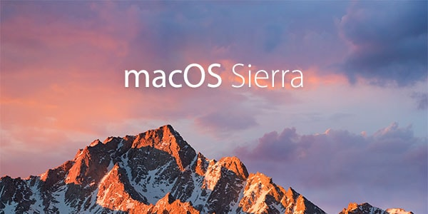

Find your Macbook slow after upgrading to macOS Sierra? I recently did too. As a developer, it was painfully obvious that something needed to be done - there is no way I can develop with my Macbook Air (mid-2013) going on overdrive when only Chrome was open. In the end, I solved the problem by finding the process that took up a lot of RAM (syncing of Internet Accounts) and removed it.

I hope this short post will help you resolve your slow and overheating Macbook woes.

## Macbook in overdrive

My Macbook was noticeably overworked immediately after upgrading from OS X Yosemite to macOS Sierra. Mine is a mid-2013 Macbook Air.

Prior to upgrading the operating system, my laptop hardly ran with an audible fan in the background, even with Chrome (> 10 tabs), Atom, Spotify and a few other apps running simultaneously. The fan turned on within 10 minutes with just Chrome running after the OS upgrade.

## Finding the problem

The first thing I thought about was Apple engaging in foul play (I still think there might be an element of this, but that's just a personal belief and I'm not interested in spreading conspiracy theories). That aside, I really wanted to resolve the problem. Googling yielded [this relevant thread on the Apple discussion forum](https://discussions.apple.com/thread/7680628?start=0&tstart=0).

A senior member in the forum recommended to use [EtreCheck](http://etrecheck.com/) to diagnose the issue. EtreCheck is a third party software that runs checks on your Macbook to find "serious problems" and "annoying adware." I downloaded the software and ran it. The report was out in about 5 minutes.

One thing immediately stood out in my report: 90% CPU usage by 2 processes. They were the `soagent` and `callservicesd`. Googling led me to [this MacRumors thread](https://forums.macrumors.com/threads/constantly-high-cpu-usage-soagent-callservicesd.1894835/) on the same issue many others were facing.

## The solution

People in the discussion forum pointed out that these two processes were related to Internet Accounts in the OS.

Internet Accounts is the central place to link up Gmail and other sorts of services to your Macbook - something useful but non-essential. To prevent the `soagent` and `callservicesd` from continuing to hog your RAM:

1. Open System Preferences
2. Go to Internet Accounts -> remove all Google-related email accounts
3. Restart your laptop
4. Verify that your laptop is running at normal speed again (no longer slow)
5. Re-add your Google email account (I re-added and the problem didn't reappear)

It may be a bug in the new macOS, I'm not sure. But I'm glad it solved the problem. Hope it does the same for you if you're in a similar situation!

**Update 16.06.2021**: I encountered this problem again, this time after upgrading to macOS Big Sur 11.4. I suspected the root cause might have been the same and applied the solution described above, and it once again resolved the problem for me.