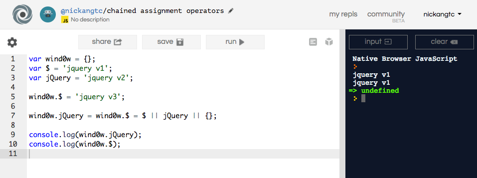

I love using repl.it, and I use it so often I can go up to a some else's laptop and type the fully formed URL in the browser: https://repl.it/languages/python. You saw me type that, right?

Digressions aside, [repl.it](https://repl.it) has really been quite helpful in my short career as a developer.

For the uninitiated, Repl (the service) is a simple web-based compiler, named after the concept of REPL (read - evaluate - print loop). It's basically a place to write code on the left pane, which gets evaluated on command and the results (or errors) are output on the right pane. A simple but powerful tool.

(If you're really new to the concept of REPL, check out this post: [What is REPL?](https://www.nickang.com/what-is-repl/))

Here's an example of how I used it today to understand what happens when someone writes 2 chained assignment operators in a single line in JavaScript.

Seeing this line of code embedded deep in our code base, I found myself a bit lost.

```js
// Two assignments in a single line? What sorcery is this?
window.jQuery = window.$ = $ || jQuery || {};
```

It was the first time I've seen someone write two `=` assignment operators in the same line. Although I suspected off the cuff that this was evaluating right to left, and assigning values that way, I couldn't be sure, so I recreated it in Repl and started fiddling with it.

```js
var wind0w = {};
var $ = 'jquery v1';
var jQuery = 'jquery v2';

wind0w.$ = 'jquery v3';

wind0w.jQuery = wind0w.$ = $ || jQuery || {};

console.log(wind0w.jQuery);  //= jquery v1
console.log(wind0w.$);       //= jquery v1
```

Both logged 'jquery v1' to the web-based simulated console. In the amount of time it usually takes to get a water bottle refill, I'd figured out how a foreign-looking piece of code works.

In my opinion, this is one of those tools that need no publicity and will grow in use organically simply because it brings developers delight. Clean UI, fast loading speed, and the feature to save code for future reference (my example lives [here](https://repl.it/Ky7p/2)). It's a sweet product, and even sweeter because it's free.

I have many more examples of Repl.it coming to save my day at work, but I don't always save them to my account. I'll write a separate post when I come across another insightful REPL!
