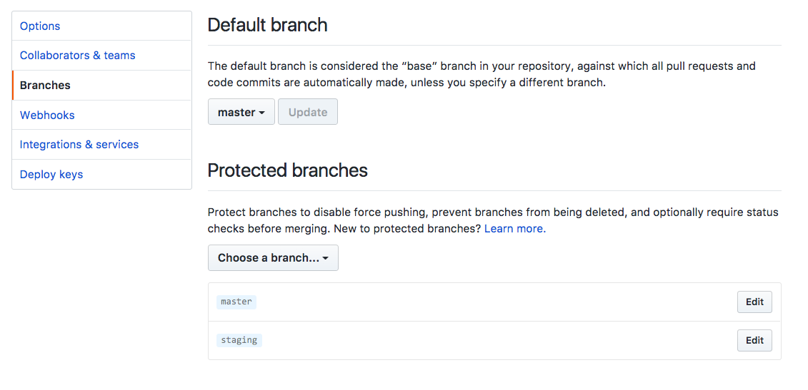

 Photo by Leo Rivas-Micoud on Unsplash

At [work](http://altitudelabs.com) recently, our CTO noticed that our main repository's `staging` branch had over 80 less commits than `master`. That shouldn't be the case, because our deployment pipeline has always been to go from `feature` -> `staging` -> `master`. Code that exist on `master` must therefore already exist in `staging`, right?

No, turns out nothing was really wrong. It's just that whenever we close a pull request (PR) on GitHub, our team protocol is to hit the "Merge" button, which merges all the commits from the PR into `master`, but not without adding one extra commit at the top called the "merge commit". Each PR created one extra commit on `master`. That was the reason for the commit count mismatch.

However, even after figuring this out, we still wanted to square off the differences between `staging` and `master` by replacing master's git branch code and commit history. It just felt cleaner, and it probably also represents the state of the 2 branches more clearly as being in sync as they ought to be.

So we cloned `staging` into `master`. Or more accurately, we force-pushed the `staging` branch into the `master` branch.

### How to completely replace one branch's code and git history with another

Here's how I did it for our team:

```
# Rename master to old-master, staging to master
$ (staging) git checkout master
$ (master) git branch -m old-master
$ (old-master) git checkout staging
$ (staging) git branch -m master

# Force push staging (now master) into remote master
$ (master) git push origin master -f

# Change branch names back to original
$ (master) git branch -m staging
$ (staging) git checkout old-master
$ (old-master) git branch -m master

# Sync local master with remote master
$ (master) git fetch --all
$ (master) git reset --hard origin/master
```

Some explanation and notes:

- `git branch -m <new-name>` renames the current branch to 'new-name'
- [`git fetch --all`](https://git-scm.com/docs/git-fetch) downloads all objects and refs from the entire repository without merging
- [`git reset --hard origin/master`](https://git-scm.com/docs/git-reset) forces your local master's latest commit to be aligned with remote's
- git branch names are just pointers, so renaming `staging` to `master` and doing a `git push origin master` will update remote's `master`
- force pushing a branch to a remote will force the remote branch to take on the branch's code and git commit history

## Potential problems

This approach definitely works. I've tried it a few times now, and it always perfectly duplicates the code and git history of one branch into another. But I faced some difficulties along the way the first time. Below are some of them and how I worked around them.

### 1\. Team members' local branch became off-sync with remote's

Using our team's example, everyone had to run `git fetch --all` and `git reset --hard origin/master` from their local `master` branch in order to synchronise with the remote's.

Forgetting to do so may cause some mess, so remember to announce to the whole team twice that you'd just rewritten a remote branch's code and history, and get them to run the necessary commands before continuing work.

### 2\. Unable to force push into protected branch

GitHub has a [protected branch feature](https://help.github.com/articles/about-protected-branches/) that prevents force pushes to certain branches in a repository. This is a really good idea, but it stands in the way of this task.

To proceed, you will need to have high level permissions (at least write permissions, I think). Now, go to your repository on GitHub > Settings > Branches and under "Protected Branches", click on Edit for the branch you want to force push into. For me, that's `master`.



Once you're redirected to the Edit page, uncheck "Protect this branch" and hit Save Changes. For security reasons, once you've saved the new setting, use this moment to quickly run the force push command on Terminal. Upon completion, re-check this box again and save.


That's it. Hope this helps!

Other git-related short tutorials:

- [How to squash git commits](https://www.nickang.com/squash-git-commits/)
- [How to use git stash (and when not to use it)](https://www.nickang.com/git-stash/)
