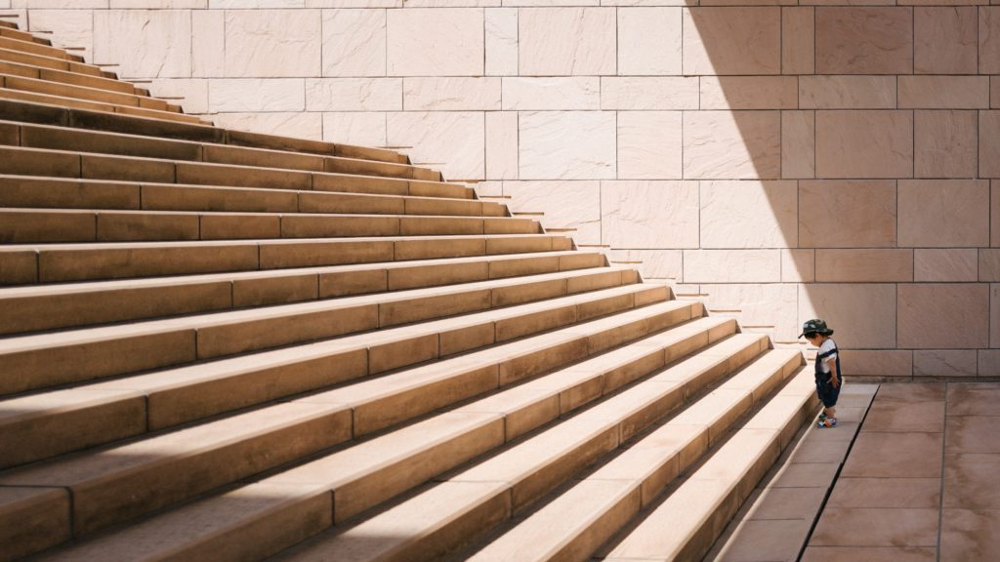
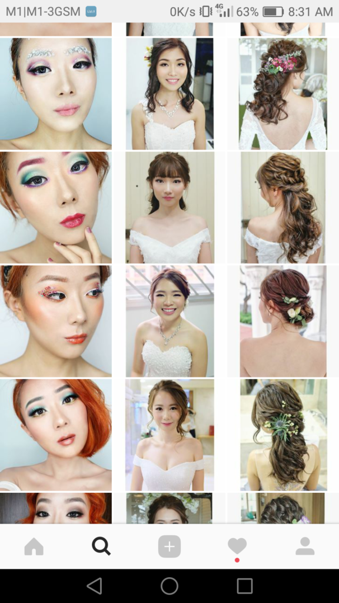

\[caption id="attachment\_1254" align="aligncenter" width="840"\] Photo by Mikito Tateisi on Unsplash\[/caption\]

Making progress is hard. Inertia can kill a project before it even begins.

But when we finally muster the courage to set time aside, subdue all distractions and create that first piece of work, it's hard to hide our pride.

On such a day that marks the beginning of a new adventure, whether the work is any good doesn't matter. Having taken the first step and creating that first painting, creative make-up, or scoftware makes all the difference in the world to us. It is inherently good work. This is, after all, just the beginning.

The first experience is always special.

But the second time is many times harder.

When we try to return to do the work the second time, it feels harder. Novelty has worn off and left us with nothing but dread.

Do I really have to do this? I don't remember it being that fun the last time... that piece of work was kinda lousy. Maybe I'm not that good at this. Perhaps I should look for something else to do with my time...

We [guilt and shame ourselves](https://www.theguardian.com/news/2017/oct/03/why-do-we-feel-so-guilty-all-the-time) out of doing what we initially set out to do.

Mei recently shared with me a little secret that she's been using to keep up the momentum she needs to keep her creative make-up project going (she's [@charlane\_yu on Instagram](https://www.instagram.com/charlane_yu/) if you want to check out her work).

It's a beautifully simple trick involving a self-imposed, arbitrarily set rule that cleverly makes use of our desire for patterns. Ready to know what it is?

\[caption id="attachment\_1251" align="aligncenter" width="576"\] My wife's make-up portfolio on Instagram (@charlane\_yu)\[/caption\]

Notice the pattern yet?

To constantly push herself to do more creative make-up, she tells herself that she needs to keep her Instagram profile page neatly organised, with all her creative make-up entries on the first column from the left, and all her other work-related make-up entries on the second and third columns.

Of course, as you'd have realised, this rule is totally arbitrary. And there's no penalty for breaking it. So why is it so effective?

I'm not a psychologist so I don't know the name that is given to this phenomenon, but I can describe it. Remember how when you were younger, you'd sometimes play a game with yourself by stepping within individual floor tiles without touching the joints?

I think our brain likes things neat, simple, symmetrical, or patterned. If every floor tile was of a different shape and size and they were laid out haphazardly across the floor, our brain would be quite displeased.

I believe Mei's clever little trick leverages this quirk in our brains.

The cool part is that you're playing the game as an adult, and as an adult, you can use this to catalyse progress in whatever you set out to do.

"But," you interject, "all this is easier said than done!" Well... I'm with you. I'm still trying to figure this out myself. How can I "game-ify" (oh wow, remember that pseudo-word?) my blogging project? Or my self-paced learning on an online course?

Those are questions to meditate on next...
