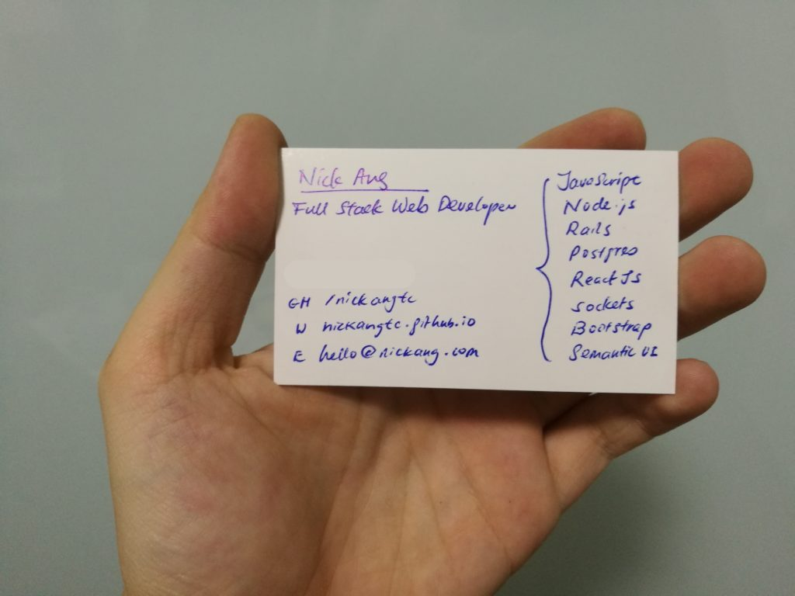

Going for a light-hearted post today. I want to share with you the ridiculously simple name card that I used to get my first developer job.

Here it is!

 The handwritten name card that got me the job

It's really simple, right? Some have told me outright that it's too simple...

Whenever I handed one of these to prospective employers, I offered an unsolicited reason to go along with it. I'd say that I couldn't get my actual name cards printed in time and that they were probably being printed as we speak.

But that wasn't the truth.

The truth is, I just didn't want to waste any money printing a stack of name cards that had my name and contact details _just_ to get a job. It never made any sense to me why people would do that. What happens to the remaining cards when you get a job offer?

More importantly, I find printing name cards for the sole purpose of job hunting feels somewhat desperate. _Did you really need a set of well-designed name cards for that extra boost in selling who you are and what you stand for?_

Before I share with you a clever list of reasons (that I mostly came up with retrospectively) to hand write your personal name cards, I feel the need to disclose the real reason I wrote my name cards when I was searching for my first developer job: I happened to have had an old stack of single-sided name cards left over from running my previous startup.

 Behind my new name card was my old name card, along with its story

Now on to the clever reasons.

### 1\. They help start conversations

You're inevitably going to get curious faces and direct questions from the person receiving your handwritten name card.

With this setup, you'd have piqued her interest and she would be ready to engage in a conversation. All that is left to do is to tell your story and make an impression.

### 2\. You can reuse old name cards (and their stories)

If they are single-sided, you are good to go.

For me, reusing leftover name cards from my previous startup really helped me share my story. Prospective employers were immediately interested to know about the startup, and all conversations led down different interesting paths.

I personally believe this was the differentiating factor that helped me land my first developer job at Altitude Labs. Justin, who is the co-founder, was looking for a "self-starter" to help start the office in Singapore, and my startup story must have given him the impression that I was right for the job.

### 3\. They are memorable

Imagine you were an employer for a moment. If you had just spent the good part of a day working a room full of potential candidates, and your goal was to schedule some initial interviews by day's end, what would you do?

For me, I imagine I would sit down in a cafe somewhere, feeling slightly worn out, and try to sieve out who among the crowd to schedule an interview with.

To jog my memory I would lay out all the name cards I've collected for the day across the table.

Provided that a candidate wasn't stiff as a Queen's Guard during the encounter, an employer is much likelier to remember details of that interaction more vividly. The guy with the handwritten name card. Cue positive recollection.

I thought it'd be fun to share this weird story today. Have you tried something weird like this during your own job hunt? How did it go?
