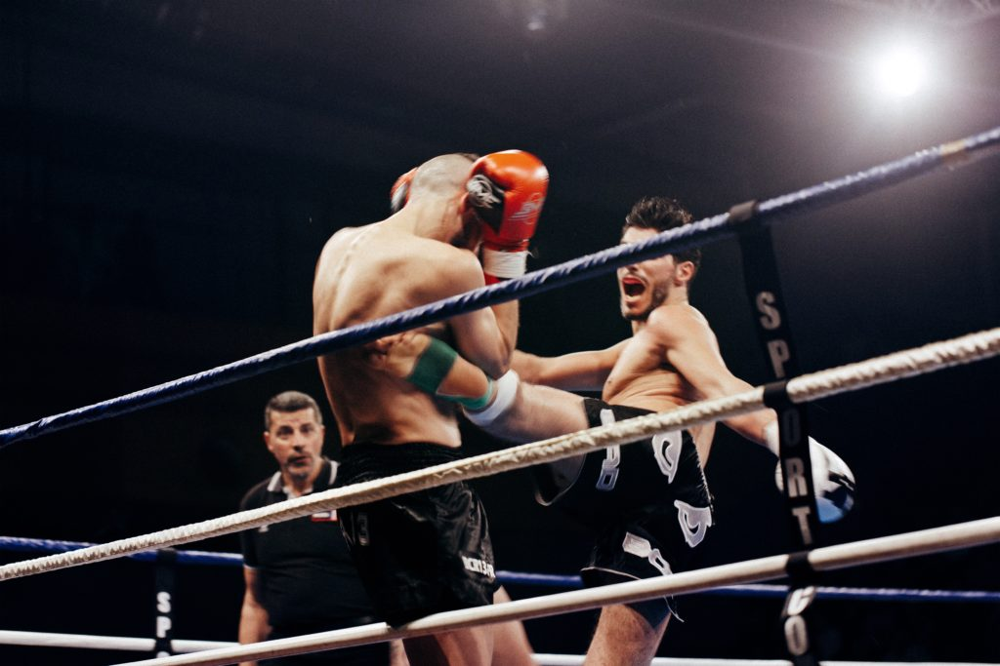
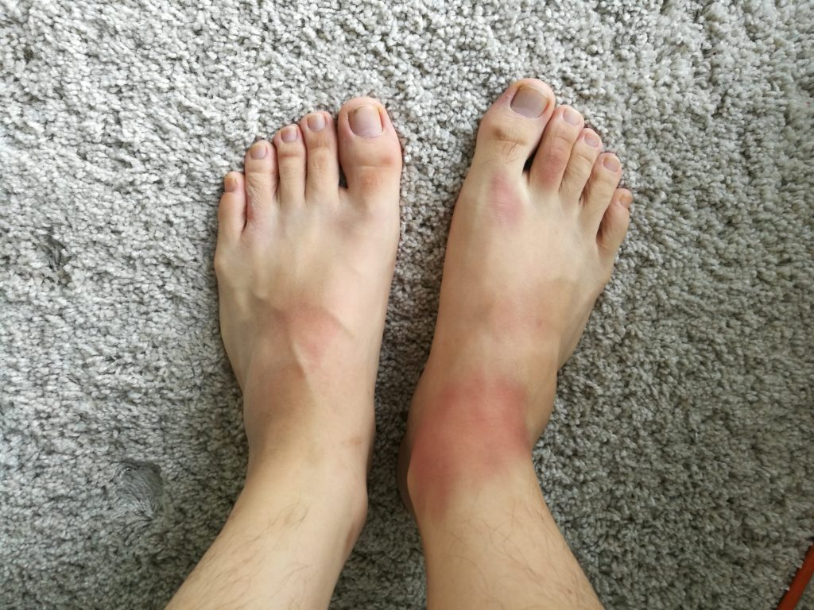

 Photo by Solal Ohayon on Unsplash

I've been going for Muay Thai classes recently. Training has been interesting so far. They switch up the routine so often that I haven't gone for enough training to actually see anything routine in it. So far, so good.

Recently, a friend who's been going for his first few training sessions as well told me how easily he bruises after training. He told me that he'd notice blue-blacks on his shins and thighs on the days after training.

When he told me this, I paid very little attention to how it relates to my training. I just politely laughed and told him to rest well so he could go back to train again soon and not hurt so much when walking around.

Yesterday, I went for training and it was the most intense sessions I've had so far. We were told to do round-house kicks on a sandbag, taking turns to do so with a partner. Perhaps it was my mind hearing what it wanted to hear, but we had to do 50 kicks, not 15 as I swear I heard, with each leg. My partner was a female fighter and she shredded the bag while waiting for me to tap it with my leg.

This morning, to my surprise, I woke up to this.

 My bruised foot after my first proper muay thai training session

That's right, bruises. My ankle has swelled up and is bruised along with the top of my foot and shin. Every inch is tender and hurts with any touch involving a slight prod.

Looking at my foot this morning, a thought suddenly occurred to me.

> My friend isn't easily bruised. He had bruised "easily" because he had been training better than I have. For that, he's making better progress.

That would explain why my left leg, which I used for my second set of 50 kicks after my right leg had completed its set, was more or less damage-free. My heart had been pounding hard by that time, and my left kicks were so weak that I'm sure they looked like they were going in slow motion to anyone observing on the side.

With Muay Thai training, if it hurts, you're probably doing it right. This idea works well across activities. A body-builder who has just completed a good workout should feel his entire body aching the next day, just as a debater should experience mental fatigue after an intense debate. (But this notion fails to hold water when taken to the extreme. If something hurts too much, you're probably doing it wrong.)

I think this also applies to software engineering. To get to the stage where we can write code that works the way we intended on the first or second try, we must first go through some of the pains of having to deal with not handling certain edge cases, making breaking changes, introducing insidious, non-error-throwing bugs, and so on. I know first hand how painful those mistakes can be.

We will only be able to kick the sandbag 50 times (or 100, or 200!) without bruising (and panting) too much after we have completed enough features and pull requests. But in general, I think it's good to be chasing the bruises. It means you are making progress in good time.
