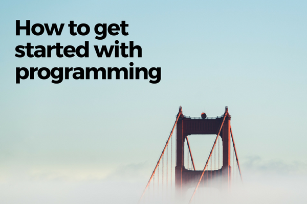

\[caption id="attachment\_1423" align="aligncenter" width="600"\] Photo by Joshua Sortino on Unsplash\[/caption\]

Hello internet!

This is the second part of _How to get started with programming_. If you haven't read [part 1](https://www.nickang.com/get-started-programming-part-1/), I highly recommend you start there as we covered some stuff that I consider pretty important to getting started.

Now that you've found your purpose, what's the best way to actually start wetting your feet in programming?

## Get started with programming with JavaScript

In yesterday's post I shared that many of my friends and even strangers like to ask me how they can get started with programming.

And if I have time, I'll always first reply with the whole "find your reason for learning first, or it won't be sustainable" thing (as shared in [part 1](https://www.nickang.com/get-started-programming-part-1/) of this post).

Right after that when we get into the practicalities, my answer is always, "**I highly recommend starting with learning JavaScript**."

Right now I can hear a dozen developers in the internet yelling, "Blasphemy! The first programming language should be X, not JavaScript!" or, "Bullshit, just pick the programming language based on the product or project you most want to build and fly that rocket to the moon!"

But let's be real here - there's no right answer. There's only the answer that we each think is best.

For me, I strongly believe that the best way to get started with programming is to learn JavaScript. Why?

Because JavaScript is _the_ programming language that is used to build web applications\[footnote\]... apart from HTML and CSS, which are markup languages, not programming languages\[/footnote\]. There are no programs that are more **accessible and relatable** than web apps today, except perhaps the operating systems that turn the lights on.

## What is JavaScript?

So then, let's talk about JavaScript.

First, let's get one thing out of the way: JavaScript !== Java. (`!==` is how you write "is not equals to" in JavaScript.)

Java was around before JavaScript was invented overnight, and JavaScript's originators thought it would be funny (actually, they thought it would be [good for marketing](https://en.wikipedia.org/wiki/JavaScript#Beginnings_at_Netscape)) to associate their newborn programming language with one of the most popular languages at the time. By some miracle, they didn't get sued.

And yes, JavaScript was literally invented overnight by someone called [Brendan Eich](https://en.wikipedia.org/wiki/Brendan_Eich)! What an incredible story. Anyway, since the release in 1995 with the Netscape Navigator 2.0 beta web browser, JavaScript has undergone puberty and is now a healthy, mature adult.

### Why start with JavaScript?

Here are a few facts to give you a flavour of what JavaScript is and has to offer:

- Invented in 1995, and is now the _de facto_ language used to build web apps (including simple websites like this blog and tremendously complex ones like Facebook)
- Can and have been used not only for building the front-end (web applications) but also in the back-end (servers)
- Can and have been used to build native apps (for iOS and Android smartphones and macOS and Windows laptops)

Let me tell you, those are attractive characteristics for a programming language!

What was once used only for dealing with what happens when a user clicks a button on a page has now developed into a full-fledged programming language used by million developers everyday in building all kinds of apps.

The JavaScript language is one of the most widely used and well documented, and its community is one of the most active (meaning it's one of the easiest languages to get help for in places like [StackOverflow](http://redmonk.com/sogrady/2017/06/08/language-rankings-6-17/)).

### How to get started with JavaScript

Ok, hopefully by now, you're sold on learning JavaScript as your first language! Even if you're not (perhaps you need to learn Python because you want to build a machine learning algorithm, for example), you can use some of the resources below to dip your toes in programming.

If someone asked me to recommend just one resource to learn to program, I would recommend [freeCodeCamp](https://freecodecamp.org) with little hesitation.

Founded by one of the most passionate and caring programmers in the world, [Quincy Larson](https://medium.com/@quincylarson), freeCodeCamp is "a community that helps you learn to code, then get experience by contributing to open source projects used by nonprofits."

On there, you learn by coding. There's no other way to move forward, which is a good thing.

Where freeCodeCamp really shines is its active and supportive community of fellow campers. It's quite possible to get help from a fellow learner within minutes when you post on their [forum](https://forum.freecodecamp.org/).

When you couple a tough stance on "learning by doing" with an active and sizeable community of mentors, you have a formidable combination to get started with programming.

As a side note on other learning portals, I've only ever tried Codecademy and freeCodeCamp. [Codecademy](https://www.codecademy.com/) is too much like a protective parent to be an effective teacher for me; its exercises are littered with overly helpful hints that breed laziness (answers are often just one click away). I much prefer struggling with a problem myself and googling for help online when I'm stuck. That way, I find that I learn faster and cover more ground.

As its name suggests, learning on freeCodeCamp is absolutely free. It isn't even a Freemium model; it is a non-profit out to do good, and the curriculum and platform are largely built by open source contributors. I'm not sure about you, but this gave me an extra reason to keep learning.

With that, you now have a good roadmap to getting started with programming. It's time to step into the jungle!

Finally, if you're just learning to program and would love to have some jungle trekking buddies, consider joining our mailing list. We're here to learn together. Also, feel free to ask questions in any related posts on this blog. I'd be glad to help you as those before me have helped me!
