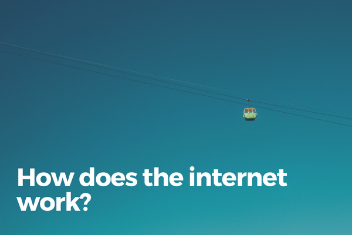

 Photo by Antonio Grosz on Unsplash

Here's a rhetorical question: Have you ever wondered how does the internet work? How is it possible that you can enter (what used to be) a cryptic string of characters and have a page full of text, images, videos and user interactions loaded just like that, like magic?

That was a rhetorical question because if you're reading this post on this obscure part of the internet (my blog, which you might have accessed (although I doubt it) by entering said cryptic string "www.nickang.com" into your browser), there's a good chance you were already looking for answer to this question. More likely, you'd have _googled_ the question and that's how you landed here.

So let's get you what you came for, shall we?

If you've wondered how this internet sorcery works, this short post is for you to lift the curtains on one of our greatest modern technological marvels.

First, a quick look at Wikipedia's definition of the internet:

> The internet is a "global system of interconnected computer networks that use the Internet protocol suite (TCP/IP) to link devices worldwide."
> <cite>[Wikipedia](https://en.wikipedia.org/wiki/Internet)</cite>

Ok, now we're ready to ask the real defining question.

### What exactly happens when I enter a URL?

When you type or, more likely, copy-paste a URL (Universal Resource Locator) into the address bar and hit Enter, **you trigger a series of multiple events that work together** to bring you what you see on the browser window.

These events occur in roughly this sequence:

1. You hit Enter with a URL in the address bar
2. Your computer, via your browser, **sends a request** (a specific _type_ of request called a "GET" request) to another computer on the internet to ask for the **contents** of the page\[footnote\]This "other" computer on the internet that serves the content based on incoming requests is called a "server," well, for obvious reasons!\[/footnote\]
3. The request makes it way through underground fibre optic cables...
4. The remote computer receives and validates the request, digs into its hard disk, retrieves the relevant content, and returns that content as part its **response** to your request
5. The response makes it way through underground fibre optic cables...
6. Your browser **receives the response**
7. Your browser interprets the content\[footnote\]Content for websites is always a combination of HTML, CSS and JavaScript\[/footnote\] that came with the response and **renders** it in the browser window

And there you have it! All of the internet works this way.

Your browser is like a window through which to browse the internet (hence its name, "browser", as you browse one of billions of webpages at a time). With mobile apps, the same idea of request-response also applies, except it's some other program rather than the browser that sends and receives data.

This is the story of the cryptic string that is actually the pin on the internet map, helping us obtain awesome web and mobile user experiences in our everyday lives with the help of the browser, a server and some content-forming code.

**Disclaimer**: I've deliberately omitted a number of important intermediate processes that are actually crucial for the entire thing to work (eg. Domain Name Service (DNS)) in this post. They are either too technical or unnecessary for a conceptual understanding of how the internet works.
