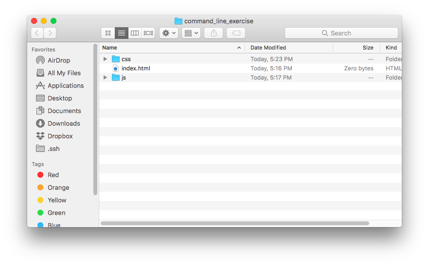
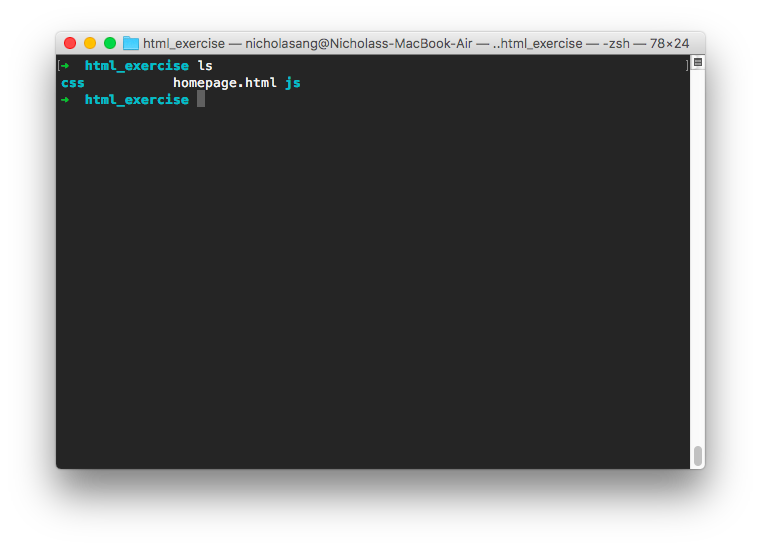

\[caption id="attachment\_1477" align="aligncenter" width="600"\] Photo by Thanh Tran on Unsplash\[/caption\]

Just getting started with becoming a programmer and want to start using the command line? This post is just for you.

Do note that I'll be going through command line commands for computers running macOS. If you're using a Linux computer, the commands are very similar and you should be able to learn something too.

As a primer, if you don't already know what the command line interface (CLI) is, you can read my post on _Why Programmers use the Command Line_ [here](https://www.nickang.com/why-programmers-use-command-line-interface/).

So, you already know why programmers prefer to use the CLI instead of doing things like everyone else and you're ready to pick it up. Where should you begin?

## Most commonly used commands

You should start by orientating yourself to the CLI environment.

Here's the first thing you need to know about the CLI: you are always working from a specific directory.

(A "directory" is just a more technical way to say "folder".)

\[caption id="attachment\_1473" align="aligncenter" width="882"\] What we normally call a "folder" is also known as a "directory"\[/caption\]

That means that whenever you write a command in Terminal, you are giving a command with respect to the current location (ie. directory) you're currently in.

Therefore, you need a way to find out your working directory at any time. To do this, you can run your first shell command.

### pwd - print working directory

```
# running this
pwd

# prints this out
/Users/nicholasang
```

[`pwd`](https://www.mankier.com/1/pwd) stands for _print working directory_. When you enter this command into the shell, it will output a path to the directory that you're currently in within the shell.

Great! Now let's move on to a few more interesting, frequently used commands.

### ls - list items in directory

While seeing your working directory is useful, it's meaningless if you cannot see the contents inside the directory.

It'd be like being in a hotel room but not knowing how you got in there. There are no windows and you can't tell which country or city this room is located. No matter how amazing the room is, you can't know what's happening outside relative to you. Kind of a bummer, eh?

```
# running this
ls

# prints this out
Applications Documents    Library      Pictures     fundamentals
Code         Downloads    Movies       Public       macports
Desktop      Dropbox      Music        anaconda3
```

[`ls`](https://www.mankier.com/1/ls) prints out all the names of files and sub-directories in your working directory. For most shells (the program that Terminal is running, which can be modified or swapped for something different), a file is differentiated from a directory with colour.

Here's how it looks on my Macbook (it probably looks different from yours because I've done some configurations and am using a different [shell](https://askubuntu.com/questions/506510/what-is-the-difference-between-terminal-console-shell-and-command-line) program called [Zsh](http://ohmyz.sh/)).



### cd - change directory

Next, let's learn about changing to another directory. This is arguably one of the most frequently used commands.

```
# running this
ls

# prints this out
Applications Documents    Library      Pictures     fundamentals
Code         Downloads    Movies       Public       macports
Desktop      Dropbox      Music        anaconda3

# and running this will change your working directory to Desktop
cd Desktop   # Desktop is the argument
```

When you run [`cd`](https://www.mankier.com/n/cd) you must specify which folder you want to "cd into", like `cd Desktop` in the above example. "Desktop" is the folder you're specifying to the `cd` command as an **argument**.

Some commands expect an argument (like `cd` and we'll soon see, `rm`), while others do not (like `ls` and `pwd`). For most of the basic commands it should be quite apparent whether the command expects an argument. For example in this case, you wouldn't be able to tell the shell _where_ to go if not for the argument.

### rm - remove item or directory

To delete an item, we use the [`rm`](https://www.mankier.com/1/rm) command, which stands for _remove_.

```
rm cute_cat_photo.jpg
```

The above command will delete the file with the name 'cute\_cat\_photo.jpg' _if it exists in your working directory_. If the file exists in another directory, you should first do a `cd <directory_name>` then run `rm cute_cat_photo.jpg`.

## What it looks like to use Terminal

You can do a lot on the command line by just using the 4 commands discussed above!

Here's a video to give you an idea of what it looks like to use these 4 commands on Terminal.

https://www.youtube.com/watch?v=tfkEvOVnWT0&feature=youtu.be

### Related thoughts

I think every programmer has their own way of using the CLI. For example, I tend to run `ls` a lot (like after every other command). I like using it a quick way of orientating myself, whereas other programmers might not use it as much.

Anyway, now that you know some commands, try them out yourself and develop your own approach to using the command line!

There are many more useful and fascinating things you can do with the CLI, which I'll cover in the next post(s) on the command line. But I believe what we covered in this post is good enough for you to start using the command line.

Have fun with your new toy, I'll see you in the next post!

**Edit (28/10/17):** Part 2 is published! Read it [here](http://nickang.com/start-using-the-command-line-part-2).

* * *

_Bite Size Programming is a segment where I discuss programming one bite-sized topic at a time in plain English. My goal is to share tips, lessons, and ideas from my work as a software engineer, and through that, make programming accessible and fun for anyone who is curious about programming. Join the [mailing list](http://eepurl.com/c7xfID) to get the latest post delivered to your inbox so you can read on the go._
