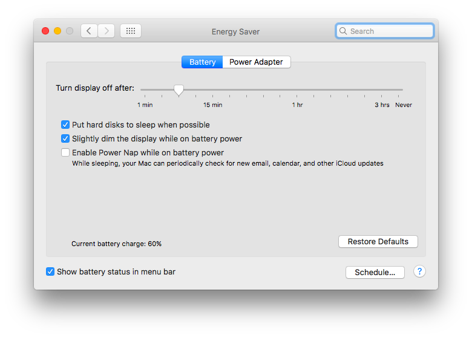
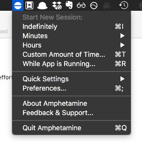

\[caption id="attachment\_1498" align="aligncenter" width="600"\] Photo by elizabeth lies on Unsplash\[/caption\]

Today's topic is a very specific problem I'd been wanting to solve but never really got around to because, well, it's annoying but not painful. I'm talking about trying to prevent my Mac from sleeping.

The reason for sometimes wanting to make sure my Mac doesn't sleep is simple: when it goes to sleep, some processes that I want to carry on running (say, while I'm out for lunch - concurrency rocks!) will stop.

An example is when I want to run a command on a remote computer using the [Secure Shell](https://en.wikipedia.org/wiki/Secure_Shell) (SSH), which I very often need to do at work. SSH establishes a connection between my Mac and the remote computer. But when my Mac goes to sleep, that connection is cut completely, and whatever process was running comes to a complete stop.

Cloning the production database into my Mac for local development, for example, is a process requires SSH and can take a few hours to finish. If my Mac goes to sleep and cuts the connection because of "lack of activity" while I'm at lunch, I'd have to restart the process from zero again.

The first time that happened, I slapped myself in the forehead and restarted the process while I'm right beside the computer. You know, so I can move the cursor once in a while to prevent it from sleeping. In the meantime, I'd work on some other task that didn't require an updated local database.

But what kind of programmer puts him/herself through that? To solve this issue once and for all, I've tried using the built-in options of my Macbook.

\[caption id="attachment\_1493" align="aligncenter" width="780"\] Tweaking options in Energy Saver in System Preferences doesn't seem to work\[/caption\]

I tried multiple combinations of checked and unchecked boxes, but none of them ever seemed to work.

## Amphetamine app

Today I really needed my Mac to not snooze, so I googled for a solution and found a beautifully designed little app called [Amphetamine](https://itunes.apple.com/sg/app/amphetamine/id937984704?mt=12), and it did the trick.

Amphetamine tackles a single problem very, very well. (You can read what other users are saying about it on [Product Hunt](https://www.producthunt.com/posts/amphetamine).) It makes sure your Mac doesn't take a nap or even so much as dim its screen if you decide that it needs to stay awake for the entire performance.

\[caption id="attachment\_1494" align="aligncenter" width="290"\] Options you get from Amphetamine app\[/caption\]

\[caption id="attachment\_1502" align="aligncenter" width="716"\] What a satisfying notification to look at!\[/caption\]

You use it via the widget in the app tray on the top bar. Click on the icon and select how long you want to prevent your Mac from sleeping from the dropdown, and voila! The job is done. Or I should say, the jobs will be done.

Thanks [William Gustafson](https://github.com/x74353) for building this simple but incredibly useful tool and for making it free (of charge and of ads). Yet another inspiring example of the good spirit in our tech community!
