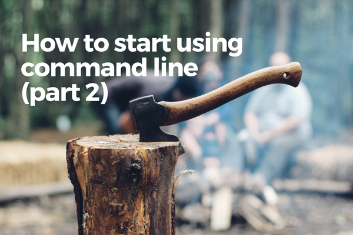

 Photo by Dan Edwards on Unsplash

Welcome to the second part of _How to start using the command line_. You can read part 1 [here](https://www.nickang.com/start-using-the-command-line-part-1/) if you haven't already - I cover the most basic commands there to get you started.

In this second part, I'll go through a few more basic commands and introduce the concept of a **flag** that you can use to modify certain commands. A flag can, for example, be used to modify the command `rm` to act on a directory instead of a file.

Let's dive in!

### touch - create a new file

The first command for this post is [`touch`](https://www.mankier.com/1/touch). Hopefully you're not too thrown off by the name of the command (but yes, it sure is a weird name). `touch` means "create file."

```shell
touch new_file.txt
```

Running this command will create a new file called "new\_file.txt" in the working directory you're in. Remember, whenever you issue a command in a [Command Line Interface](https://en.wikipedia.org/wiki/Command-line_interface) (CLI), you're issuing it from a particular working directory. (If you don't remember, you can run `pwd` to print the working directory you're in.)

Note that by default, this new file is always going to be empty.

### mkdir - create a new directory

```shell
mkdir new_directory
```

[`mkdir`](https://www.mankier.com/1/mkdir) stands for "make directory", and it is the equivalent of `touch` for creating a new directory.

Once a directory is created, you can `cd` into it and make new file babies or even more subdirectories.

```shell
cd new_directory
```

### A primer on "flags" and man

Let's say you have a directory called "directory\_with\_3\_files" with 3 files in it, and you want to delete the directory along with all its files and subdirectories. How might you do that using the `rm` command?

If you thought to do this:

```shell
rm directory_with_3_files
```

You'd have made the most logical guess, but `rm` doesn't work that way.

```shell
# running this
rm directory_with_3_files

# outputs this error message
rm: directory_with_3_files: is a directory
```

Don't worry, I made the same mistake when I first learned to use the CLI too. It's just a very specific quirk that I believe most first-timers will make.

So how _do_ you delete an entire directory along with its contents?

```shell
rm -r directory_with_3_files

# trying to cd into the folder
cd directory_with_3_files

# outputs
cd: no such file or directory: directory_with_3_files
```

The difference here is the `-r` flag. It tells the `rm` command to work "recursively" (I think that's what the "r" stands for) and delete everything within.

To quickly verify that the directory has really been deleted, you can try to `cd` into it. Terminal should complain that the directory doesn't exist!

Each command can have multiple flags. To find out all the options that a command has, which are toggled by passing in flags, you can always run `man <command>`, like `man rm`.

[`man`](https://www.mankier.com/1/man) stands for manual, and every built-in command has a handy manual on standby to help you out when you need the details.

To pass in multiple flags, you can just stick them together like `rm -rf unwanted_directory`. (Feel free to use `man` to find out what `-rf` means!)

Ok, that's all you need to know about flags! Now let's return to our regularly scheduled programming...

### cp - copy a file or directory

```shell
# make a copy of original_file.txt in current directory and call it copied_file.txt
cp original_file.txt copied_file.txt

# pass in the -r flag to copy a directory
cp -r original_directory copied_directory
```

[`cp`](https://www.mankier.com/1/cp) stands for "copy". By default, the `cp` command works on files. You can use it on directories by passing in the `-r` flag that you've just learned about!

### mv - move a file or directory

Ok, let's learn one final command with this post: [`mv`](https://www.mankier.com/1/mv).

```shell
# move a file one directory up
mv file.txt ../file.txt

# move a directory one directory up
mv folder_name ../folder_name

# rename a file
mv new_file.txt renamed_file.txt
mv folder_name renamed_folder_name
```

### Taking stock

So if you've read part 1 and this post, and tried some of the commands yourself on Terminal, you now know these commands:

- **pwd**. Print working directory
- **ls**. List contents of working directory
- **cd**. Change directory
- **rm**. Delete (permanently) a file or directory
- **touch**. Create new file
- **mkdir**. Create new directory
- **cp**. Copy file or directory
- **mv**. Move file or directory
- **man**. Show manual for any built-in command

### What's next?

I hope that this post and [part 1](https://www.nickang.com/start-using-the-command-line-part-1/) has been helpful in equipping you with some of the basic concepts and commands to get you started with using the command line! If there's anything you think I missed out or you think you'd like to learn about, please leave a comment and I'll _refactor_ them in when I can.

Anyway, did you notice the weird `../` characters roaming this post? I wanted to keep these two posts on the command line purely about the commands, that's why I didn't mention these characters. But they are nevertheless important to working with the command line.

For that, look out for an upcoming post on **paths**. For some ideas of what other things programmers use the command line for, check out some of [my](https://www.nickang.com/why-programmers-use-command-line-interface/) [other](https://www.nickang.com/tunnel-http-requests-into-localhost/) [posts](https://www.nickang.com/programmers-remote-work/). Till then, have a bug-free day!

* * *

_Bite Size Programming is a segment where I discuss programming one bite-sized topic at a time in plain English. My goal is to share tips, lessons, and ideas from my work as a software engineer, and through that, make programming accessible and fun for anyone who is curious about programming. Join the [mailing list](http://eepurl.com/c7xfID) to get the latest post delivered to your inbox so you can read on the go._
