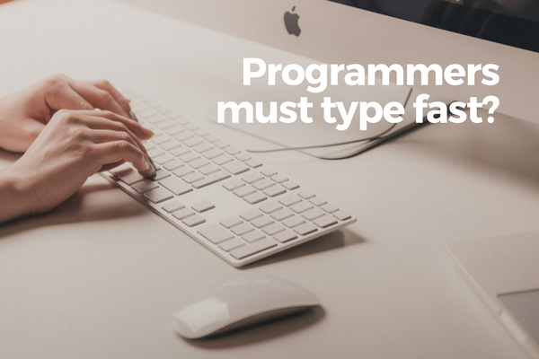
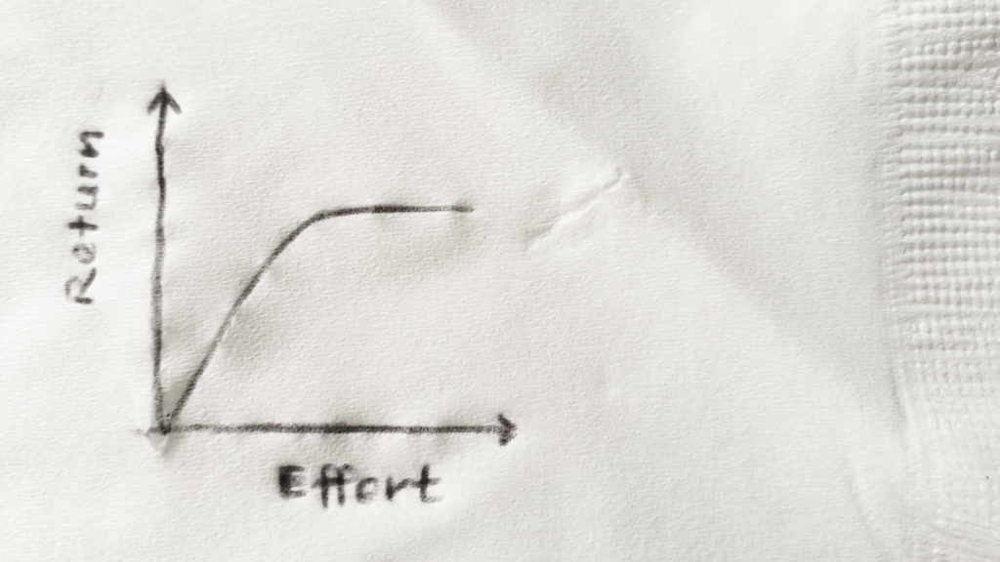

 Photo by Ilya Pavlov on Unsplash

Let's talk about a complete misconception today. I'll put it out there... **you don't need to type fast to be a programmer**.

Why?

Well, mainly because 99 percent of the time, your brain is playing catch up with your fingers.

This disparity between brain processing speed and typing is confounded by a few important factors that I've come to realise as I continue coding every day as a professional programmer.

## Why you don't need to type fast to be a programmer

### 1\. Typing speed is not coding speed

This may not come as a surprise to you, but it's worth emphasising: typing is not coding. With modern text editors and **Integrated Development Environments (IDE)**, you can code without typing very much.

You can code without typing letter by letter because of numerous fantastic features built into the text editor (I use [Atom](https://atom.io/), which comes with enough of these features).

With autocomplete, for example, you can conjure up multiple lines of code with just a few characters. Typing "form" and hitting `Enter` in Atom will automatically insert the the opening and closing `<form>` tags, along with the common attributes expected when using a form.

Here's another neat trick: when you select a word and use the hotkey `Cmd + D`, Atom will automatically find and highlight the next time this word appears. This is really handy and saves a lot of typing.

Here's how much typing I actually needed to write the HTML code for a Login form (example below).

    

## This is a form!

    Email
    
    Password
    
    Submit

https://www.youtube.com/watch?v=dDRnKW1qbzA&feature=youtu.be

Relatively speaking, that is not much typing at all, right? That code involved me typing just a few characters and hitting enter, moving my cursor around a lot using the arrow keys, and copy-pasting.

### 2\. Programming is more about thinking than writing code

Another reason you don't need to type fast to be a programmer is that programming is about much more than just writing code.

Given a bug to fix or a partial feature to implement in a day, I typically spend about 4/5 of the time thinking about how to solve the problem effectively. That means considering things like whether the code runs efficiently, whether it is readable and easily understood by another programmer, and whether it can work independently without affecting other parts of the code.

That means that I'm typically only hitting the keyboard like a mad person about 1/5 of the time. The rest of the time is my being a mad person in my own head.

So does typing not matter at all?

## When typing matters

No, typing still matters, but not in the way that Hollywood and real-life programming zealots want us to believe.

To be a programmer, **you should be able to type without having to think too hard**. This is when typing actually matters to being a programmer. It's not about break-finger speeds.

Here's an eloquent [answer](https://www.quora.com/Are-all-programmers-fast-typists) on Quora expanding on this:

> Typing fast is not important in and of itself: you want to be able to type without interrupting your train of thought. That's the crucial skill for programmers. Programming, after all, is all about thinking; the code you're writing is just an imperfect interface between your thoughts and the machine. You should do everything you can to make thinking easier.

Towards that end, being able to type fast is an advantage, albeit a small one. It's like that graph of diminishing returns. Eighty percent of the gains come from being able to type without thinking hard, and the other 20 percent comes from typing fast and accurately.

 The graph of diminishing returns drawn (pardon the napkin)

And so the truth is out - you really don't have to type fast to be a programmer!

That said if it's your thing to push yourself in this area, improving your typing speed can be quite fun. My personal typing speed is about 101 words per minute (WPM), and this [typing speed test](http://typing-speed-test.aoeu.eu/) app tells me that I'm faster than 98.69% of people who did the same test. Cheap thrills, anyone?

Just for fun, here's the typing test I took. Feel free to have a go at it, but please don't take it as validation or disqualification of you becoming a programmer!

http://typing-speed-test.aoeu.eu

If you're interested, I wrote about some of the other things that people commonly (but inaccurately) believe to be important qualities of a programmer - you can read that [here](/2017-10-25-programming-is-not-for-everyone/).
