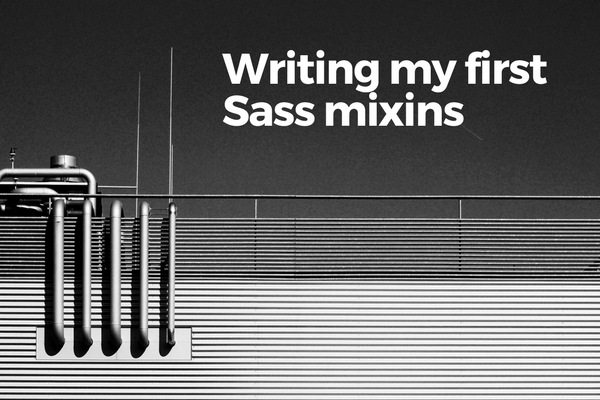

 Photo by Dmitri Popov on Unsplash

[Sass](http://sass-lang.com/) is a CSS **pre-processor**. Even though I've been using Sass in many projects, I realised recently at work that I'd only been using it in a very primitive way. Sass mixins didn't even exist in my mind.

The main ways I'd been using Sass are:

- declaring variables in a single file as the main way of easily configuring an entire project
- extending/inheriting selectors to reduce repetition (to keep the code **DRY**)
- nesting selectors to create and maintain a clear visual hierarchy

But there's an incredibly useful feature of Sass that I'd been missing out on. I only accidentally stumbled onto it recently - it's called **Sass mixins**.

## Sass mixins are like functions for CSS

Instead of telling you what mixins are, let me just show you the code that I recently had to write. It was a familiar situation: I knew what I had to do and I knew at least one way to achieve it, but I also knew there was a good chance that a better way to do it exists.

This is the badge (`.badge-deprecated`) I needed to code. We already had an existing badge called `.badge-uninstalled`, but just repeating the code would be a bad solution. Hard to maintain and follow.

 The badge and tooltip I had to style

Here's the code that I might have written if I hadn't known about mixins.

.badges-nav-bar {
    // notice this class...
    .badge-uninstalled {
        .badge-container {
            cursor: default;
            width: 106px;
            margin: 13px 8px;
            border: 1px solid $brand-gray;

            .badge-content {
                width: 100px;
                font-size: 12px;
                text-align: center;
                text-transform: uppercase;
                background-color: $brand-gray;
                color: white;
                float: left;
                border-radius: 999px;
            }
        }

        .tooltip-inner {
            background-color: $brand-gray;
        }
    }

    // ... and this class
    .badge-deprecated {
        .badge-container {
            cursor: pointer;
            width: 106px;
            margin: 13px 8px;
            border: 1px solid $brand-red;

            .badge-content {
                width: 100px;
                font-size: 12px;
                text-align: center;
                text-transform: uppercase;
                background-color: $brand-red;
                color: white;
                float: left;
                border-radius: 999px;
            }
        }

        .tooltip-inner {
            background-color: $brand-red;
        }
    }
}

Looking at `.badge-uninstalled` and `.badge-deprecated` you might have noticed that they have almost identical styling except for a few attributes like `cursor`, `background-color`, and `color` in a few selectors.

In JavaScript or in Python, which are the two languages I use at work daily, the solution would be easy. Make a function to abstract the common factors and call the function with arguments to customise the final output!

"If only it were that simple," I thought to myself. Until I [read](http://sass-lang.com/guide) the Sass documentation...

Here's the code that I ended up writing after having my eyes opened by mixins:

.badges-nav-bar {
    @mixin badge($base-color, $text-color, $cursor) {
        display: inline-block;

        .badge-container {
            cursor: $cursor;
            width: 106px;
            padding: 2px;
            border: 1px solid $base-color;
            border-radius: 999px;
            font-weight: bold;
            letter-spacing: 1px;
            float: left;

            .badge-content {
                width: 100px;
                font-size: 12px;
                text-align: center;
                text-transform: uppercase;
                background-color: $base-color;
                color: $text-color;
                float: left;
                border-radius: 999px;
            }
        }

        .tooltip-inner {
            background-color: $base-color;
        }
    }

    .badge-uninstalled {
        @include badge($gray, white, default);
        float: left;
        margin: 13px 8px;
    }

    .badge-deprecated {
        @include badge($brand-danger, white, pointer);
        margin: 8px 8px 8px 13px;
    }
}

This works because of two great features that a pre-processor like Sass offers:

1. Variables. You can assign a value to a variable just like you can in any programming language
2. Mixins. You can write a function that accepts arguments and those arguments become variables whose values are inserted everywhere inside the selector

In other words, Sass supercharges CSS, making it work much more like a programming language than a markup language.

### Why is this better?

Being able to abstract an entire set of selectors and styles, including nested selectors, into a function-like "mixing" is fantastic because:

- It reduces repetition by allowing you to define a set of styles once and use it as part of other styles. When code is in one place, the great side effect is that making changes become trivial
- It makes your CSS much easier to understand. The `.badge-uninstalled` and `.badge-deprecated` classes now clearly look like they take from whatever is in the `badge` "function"

I'm really happy to have met this small challenge at work recently and learned about Saas mixins. I can already think of other ways to use it and will be experimenting with them the next time an opportunity arises!

PS. In case you didn't already know, Saas is actually an amazing acronym: _syntactically awesome stylesheets_!

**Definitions used in this post:**

- DRY stands for Don't Repeat Yourself. It's a basic rule of thumb for programming anything, because if you have to repeat code, you're probably not making use of methods of abstraction (like creating a function)
- Pre-processor in this context refers to something that pre-processes your CSS code (in fact, Saas files are in the format of `.scss`, which after processing, becomes the standard `.css` file. Since this processing takes place before the browser gets to see the end product (ie. your `.css` file), it's called a pre-processor.

**Edit (091117):** I somehow managed to spell Sass as Saas for the entire post without realising it, even though I spelled out _syntactically awesome style sheets_! Weirdo. Corrected.
