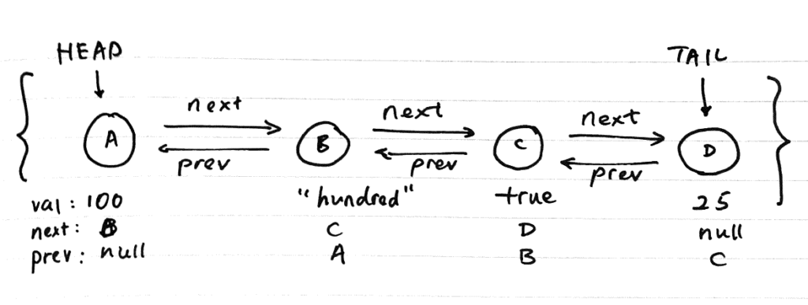
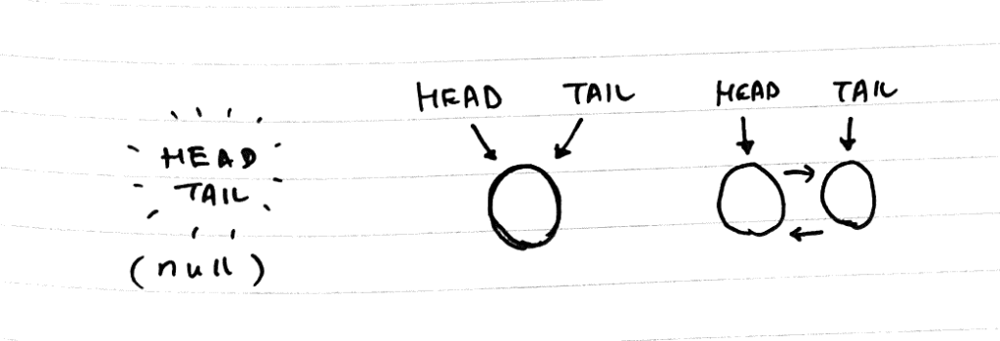

 Photo by LinkedIn Sales Navigator on Unsplash

In this post, you'll learn how to implement a linked list in JavaScript. This is the second part of a 2-parter post on linked lists (read [part 1](/2017-11-17-linked-list-explained-part-1/)).

Let's jump right in!

### Key components

Here are the key components of a linked list data structure:

1. A `LinkedList` constructor used to create a single LinkedList instance
2. A `Node` constructor used to create several Node instances
3. A few instance methods added to the `LinkedList` constructor used to execute common operations like `addToHead`, `removeFromTail`, and `indexOf`

This is what a linked list looks like conceptually:

 Conceptual illustration of what a linked list looks like

To get started, we need to declare two constructor functions (or "classes" if you're using ES6). One constructor is for constructing new linked list objects and the other is for constructing new node objects.

Before going into the code, let's establish what each of these objects is supposed to keep track of and be able to do.

A linked list object is responsible for keeping a reference to the left-most node (referred to as the "head") and the right-most node (the "tail").

Remember, linked lists are a linear data structure and therefore data elements exist in sequence within. Saying that the elements go from left to right is just to aid our mental visualisation.

Because we'll be learning to implement a **doubly linked list**, which goes through all the steps needed to implement a singly list and more, a node object is responsible for keeping references to the node object on its right and left.

Finally, a linked list object needs to have instance methods that let us add, delete, and search for nodes.

Here's a summary of the responsibilities and capabilities of each of the 2 types of objects:

- Linked list object: keeps reference of head and tail nodes, and has instance methods for adding, deleting, and searching for nodes
- Node object: keeps reference of the node object to its right and left

### Linked list and node constructors

Now let's see how to implement the two constructor functions.

```js
function LinkedList() {
  this.head = null;
  this.tail = null;
}

function Node(value, next, prev) {
  this.value = value;
  this.next = next;  // the node to its left (if any)
  this.prev = prev;  // the node to its right (if any)
}

// just for testing, create an instance of both each
var ll = new LinkedList();
var nodeA = new Node(10, 'NodeB', null);
```

What's happening here?

- Create a new instance of `LinkedList` and assign to variable `ll`
- Create a new instance of `Node` and assign to variable `nodeA`
- With these two functions correctly constructing new instances, we have created the foundation for a linked list

One more point to take note of is what happens if there is only one node in the linked list. When that happens, both the `head` and `tail` should point to the same node.

 Head and tail pointers of a linked list with no node, one node, and multiple nodes respectively

### Method to add a new node to the tail

Next, let's add our first instance method to the `LinkedList` constructor and call the method on our `ll` instance.

(Note that we'll be adding methods to the `prototype` chain. You can also declare it directly within the `LinkedList` constructor function if you want. There's just a slight difference in terms of performance (the former uses less memory - read more about the differences [here](/2016-09-05-javascript-prototypes/).)

```js
LinkedList.prototype.addToTail = function(value) {
  var newNode = new Node(value, null, this.tail);
  
  if (this.tail) this.tail.next = newNode;
  else this.head = newNode;
  
  this.tail = newNode;
};

var ll = new LinkedList();
ll.addToTail(10);

console.log(ll);

// =>
{ head: Node { value: 10, next: null, prev: null },
  tail: Node { value: 10, next: null, prev: null } }
```

What's happening here?

- We added `addToTail()` to the `LinkedList` so every instance can make use of the method to add new nodes to its tail
- A new node object with value 10 was created because we called `ll.addToTail(10)`
- Since this node is alone in the list, its `next` and `prev` attributes are `null`
- Our linked list `ll` now has both its `head` and `tail` pointing at the sole node in the list

Take a moment here to pause and understand how the `addToTail()` method works. As with code examples, things tend to appear quite straightforward until you actually try to implement it yourself.

It took me a few tries to get this first method right, but when I did, I knew I understood exactly how a linked list is supposed to work.

I'd recommend you try to implement the method on your own as well. You can do that on a [REPL](/2017-09-12-silly-useful-things-repl/) tool like [repl.it](https://repl.it/languages/javascript).

Done? Great!

### Method to remove node from the tail

Next, we'll add a `removeFromTail()` method that we can call to delete the tail node and return its value.

```js
LinkedList.prototype.removeFromTail = function() {
  if (!this.tail) return null;
  
  var value = this.tail.value;
  
  this.tail = this.tail.prev;
  
  if (this.tail) this.tail.next = null;
  else this.head = null;
  
  return value;
}

ll.addToTail(15);
ll.addToTail(99);
ll.addToTail(105);
ll.addToTail(40);
ll.addToTail(20);
console.log(ll.removeFromTail());
// => 20

console.log(ll);
// =>
LinkedList {
  head: 
   Node {
     value: 10,
     next: Node { value: 15, next: \[Object\], prev: \[Object\] },
     prev: null },
  tail: 
   Node {
     value: 40,
     next: null,
     prev: Node { value: 105, next: \[Object\], prev: \[Object\] } } }
```

At this point you're probably getting familiar with the behaviour of a linked list.

We can add a new node to the tail of our linked list `ll` by calling `ll.addToTail(someValue)`. To remove a node and get its value, we can call `ll.removeFromTail()`.

In `removeFromTail()`, we take care to make sure that the linked list `tail` will point to the second last node (the new tail) and ensure that node's `next` value becomes `null` (because after removing the tail node, this new tail will have no nodes on its right).

You can verify that it is working correctly by logging `ll` to the console, which we've done in the code snippet above.

You'll notice from the console log that our linked list `ll` is a `LinkedList` object with its `head` pointing at a `Node` object with value 10, and its `tail` is pointing at another `Node` with value 40.

But if you look carefully, there's actually one other node that is obscured from our view even though we've logged `ll` to the console.

Our linked list at this point should look like this:

```
10 (head) - - - 15 - - - 99 - - - 105 - - - 40 (tail)
```

While console logging `ll` gave us a glimpse into the nodes that contain the values 15 and 105 via the `next` and `prev` attributes of the nodes at the `head` and `tail`, we aren't able to see the node with the value of 99. That's because it's in the body of the linked list.

### Method to search for a node by its value

So now let's add one more useful method to our linked list that we can use to traverse the entire list from node to node to search for any node by their value.

```js
LinkedList.prototype.search = function(searchValue) {
  var currentNode = this.head;
  
  while (currentNode) {
    if (currentNode.value === searchValue) return currentNode;
    currentNode = currentNode.next;
  }
  return null;
}

console.log(ll.search(99));

// => 
Node {
  value: 99,
  next: 
   Node {
     value: 105,
     next: Node { value: 40, next: null, prev: \[Object\] },
     prev: \[Circular\] },
  prev: 
   Node {
     value: 15,
     next: \[Circular\],
     prev: Node { value: 10, next: \[Object\], prev: null } } }
```

Great! Now having declared the `search` method, we can call `ll.search(99)` to find and return the first node with that value. If no such node exists, we should get `null`.

Notice that our console log showed us that the node with value 99 was found and returned to us.

## All together now

Stitch all of the above together and throw in a few extra methods (like `addToHead`, `removeFromHead`, and `indexOf`) and you'll get a basic implementation of a linked list in JavaScript!

Here's my gist of it:

<script src="https://gist.github.com/nickangtc/086c6a9391ed150725cd05e007e7ff3d.js"></script>

**References and additional resources:**

- My [post](/2017-11-15-algorithm-time-complexity-big-o-notation/) on Big O notation and time complexity
- [Wikipedia](https://en.wikipedia.org/wiki/Linked_list) article on linked lists
- Udemy [course](https://www.udemy.com/learning-data-structures-in-javascript-from-scratch/) by Eric Traub: Learning Data Structures in JavaScript from Scratch. I highly recommend this course - the instructor is concise and covers many data structures, including linked lists
