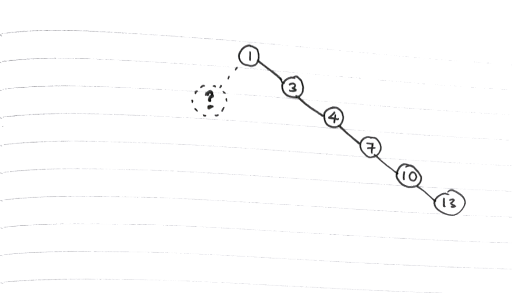

 Photo by Nathan Fertig on Unsplash

If you already know what a binary search tree is for and how it works, read on to learn about their main strengths and weaknesses in this post! Otherwise, feel free to take a moment to read [part 1](/2017-12-03-binary-search-tree-explained/) for an introduction.

Why is a binary search tree useful? What are some of its main weaknesses?

Let's try and answer those questions in this post.

bi

## Why use a binary search tree?

The main reason to use a binary search tree is the fact that it extends the capability of a normal array.

An array is a data type that stores data points contiguously in sequence. Each element in the array has an index, and in that way, they can be accessed very quickly with `A[0]` to get the first element or `A[103]` for the 104th element, for example. Arrays have constant time or O(1) access. (Read more about the Big O notation [here](/2017-11-15-algorithm-time-complexity-big-o-notation/).)

But while indexing lends array strength, it is also its weakness.

For example, if you wanted to add an item into an existing array of length 100 at the 50th position, you would have to update the index of the elements in the 50-100 positions (adding 1 to each of them). This happens behind the scenes. In the worst case scenario, as is the case when you add a new element to the front of an array, this would be a linear time operation (O(n) time complexity).

var foodArray = \['hollandaise', 'fish', ..., 'cracker'\];
console.log(foodArray.length);  // 100

foodArray.splice(50, 0, 'egg');
console.log(foodArray.length);  // 101

When the above code snippet is executed, all elements after the newly inserted element will have to be re-indexed. This O(n) time operation is not extremely slow, but another data structure (guess which?) can do better.

A binary search tree does not store an index of its data elements. Instead, it relies on its implicit structure (left or right of each node) to keep a record of where each element is. The result is insertion and deletion at logarithmic time, or O(log n).

Here's how an eloquent answer on [Quora](https://www.quora.com/What-are-some-practical-applications-of-binary-search-trees/answer/Eugene-Yarovoi?srid=pJ7U) puts it:

> A binary search tree "can efficiently maintain a dynamically changing dataset in sorted order, for some 'sortable' type."

I describe this in my head as the ”always insert in the right place" approach. This approach ensures that we can conduct [binary search](/2017-11-22-binary-search-explained/) on the entire binary search tree at any time without having to re-order anything.

Because of this structure, insertion and deletion of nodes can be achieved very quickly. Instead of traversing every element sequentially until the right one is found, which is how we work with arrays, we only need to traverse half the tree, then half of half the tree, then half of half of half the tree... I think you get the picture - the result is much faster insertion/deletion than array, with _almost_ none of the draw backs. We’ll touch on a BST’s main weakness very soon.

So what are some use cases? The main use case that I find relatable is in indexing database entries. If you have a user table in your database with 1 million entries and you need to find the user with email 'hello@world.com', you can get there with a **balanced** binary search tree in at most 21 iterations.

If it was an array and sorted by email string (_if_ it was sorted), it would probably still take 1/5th of a million iterations to get to emails starting with "h." That's 21 versus 200,000.

## The main weakness of a binary search tree

Earlier I mentioned a "balanced" binary search tree. Let’s deconstruct that idea now.

A binary search tree can get out of balance. This is the first thing to realise about a binary search tree.

For example, if we attempted to insert the following sorted array into a binary search tree, we will end up with a massively imbalanced tree.

\[1, 3, 4, 7, 10, 13\]

… will result in a tree that looks like this…

 Doesn't even look like a tree when it's this imbalanced...

Ugliness is not the only problem with such a tree - performance, as you can imagine, will also be negatively affected.

For example, to search such a tree, we would have to traverse practically all the nodes in sequence. In this situation, which is really the worst case scenario of a binary search tree, we might as well be using a conventional array!

It's interesting - some refer to a horribly imbalanced tree as a "degenerate." The more imbalanced, the more degenerate it is, and the closer it is to behaving like an array.

This is why a mechanism is needed to _balance_ the tree. Think of it as a regulator, ensuring that the tree is reorganised so that we never end up with a tree that is heavy to the left or right side.

The more balanced a tree structure is, the quicker it is to search, insert, and delete elements - the core advantage of using a binary search tree data structure.

In the next post (to come), we'll look at how to create a self-balancing tree.

## Summary

- BST will only work when storing a sortable data type (?)
- BST can search, access, insert, and delete data elements in logarithmic time `O(log n)`
- BST is much faster than an array at search, insert, and delete (`O(log n)` vs `O(n)`)
- BST is slightly slower than an array at access (`O(log n)` vs `O(1)`)
- BST’s main weakness is its tendency to become imbalanced if left unregulated by some self-balancing mechanism
