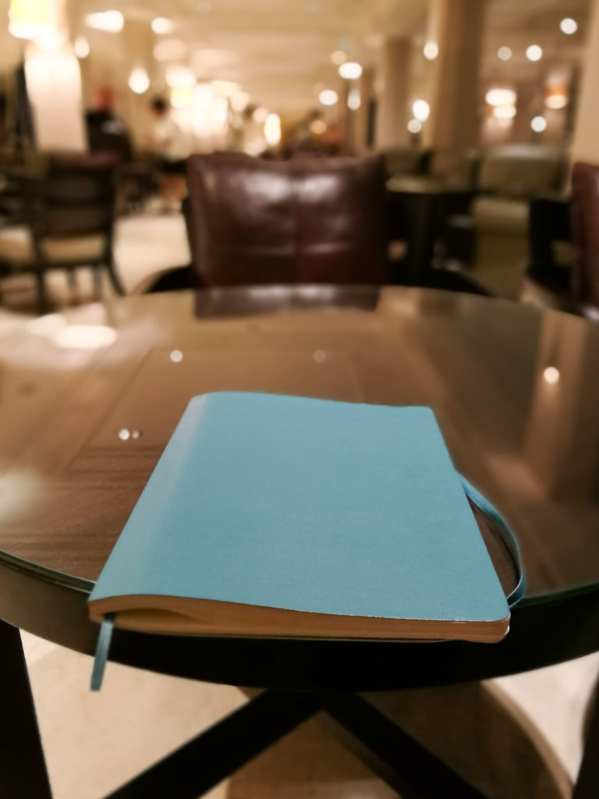
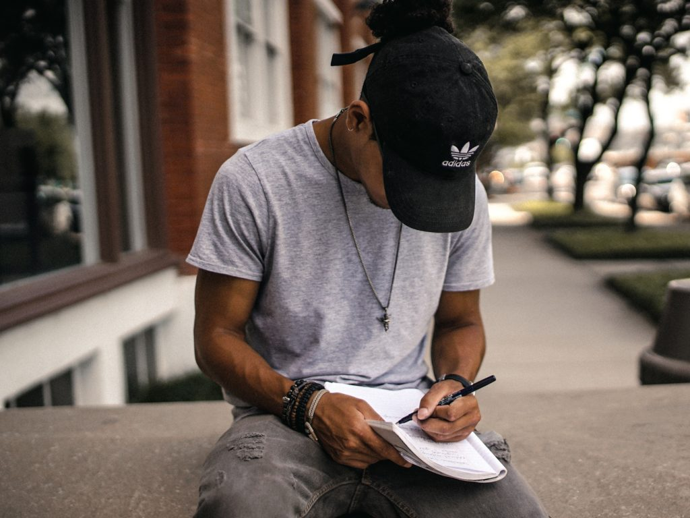

 The Moleskine notebook I used every step of the way in 2017

I'm not doing this for the sake of tradition or anything like that. Instead, I'd just like to make use of the pensiveness that comes for free at the end of the year to do some visualisation of what the new year is going to be like for me, my wife, and my dog.

### Resolution 1: Get outta here

 Photo by Lou Levit on Unsplash

I resolve to **relocate to California for work with my wife (and our dog)**. We have both always wanted to live abroad for an extended period (ie. more than 1-2 months), and I believe this is the time to do it.

My year-old career in tech puts us in a good position to find a job in the Bay Area, so it's as good an opportunity as I can ask for (though it's not going to be easy to find a good job at my level of experience).

Also, we're both getting close to 30, and we had long ago set ourselves the goal of having our first child born before we are old (old being 30 at the moment, though I understand it's all relative). With somewhere south of 2 years left to live up to that, I think, as they say, time is of the essence here.

I can't stress enough that I don't think there's going to be a better time. Charlane and I already have growing responsibilities as homeowners and service providers. Soon, we can expect to throw in "parent" and "caregiver" into the mix as our parents enter old age. So this is resolution number 1 - it's the big fish.

For the record, the header for this resolution--"get outta here"--is to elicit fun and adventure, not escapism. I can honestly say that I'm not wanting to live abroad because of any resentment towards Singapore. I like the city-state that I grew up in more each day as I age - true story, but more on that another time.

I would consider myself as having fulfilled this resolution if:

- I have accepted a job offer in the US
- My wife and dog have relocated with me

### Resolution 2: Develop one meta super-skill

 Photo by Brad Neathery on Unsplash

I resolve to develop one meta super-skill this year. There are innumerable articles out there (even just from [Medium](https://medium.com)) with headlines like "The 7 skills that super successful people have" (most of them insufferably hollow), but I'd like to separate the wheat from the chaff and bake one of them into my lifestyle.

To keep this year's resolutions, I'm making sure that I don't bite off more than I can chew, that's why I'm only going to go for one super-skill for the entire year (though I know I can _probably_ do better).

So to be specific, I resolve to **develop the super-skill of keeping a [commonplace book](https://en.wikipedia.org/wiki/Commonplace_book)**.

What's a commonplace book? Apparently, it's a thing since early modern Europe, where people record things they chance upon and want to remember into a book. I stumbled upon this idea from reading an [article](https://ryanholiday.net/how-and-why-to-keep-a-commonplace-book/) by Ryan Holiday.

Specifically, I want to keep a version of the commonplace book that [Ryan Holiday](https://ryanholiday.net/) uses, which makes use of loose pieces of index cards instead of pages in a book. Every card contains a single thought, anecdote, quote, or idea that I want to remember. In the middle of the card is the message, and at the top right is the category, theme, or project. Message and label. Simple.

Although I've already been doing a version of this in Evernote, I can see a few added advantages of doing it in writing and on individual physically-sortable index cards instead of magical pixels:

- Space constraints on a 4 x 6 card forces me to be succinct
- Easy to achieve a bird's eye view by laying the cards on a table, which will help me see patterns and formulate a logical flow if I'm writing a longer essay or even a book
- Writing by hand is more laborious than typing, which naturally prevents me from hogging behaviour ("I should keep _this_ part in too...") and be more deliberate
- Being physical items allows me to brainstorm away from the laptop, which I believe will help focus and improve flow

I would consider myself as having fulfilled this resolution if:

- I engage in marginalia, which is the act of taking notes on the margins of a book, with every book I touch this year (including audiobooks)
- I successfully revisit every book one week later in a sit-down session to transcribe the best stuff into index cards
- I have at least 24 cards written down by the end of 2018, which is 2 cards per month

### Resolution 3: Find a go-to physical activity for exercise

 Photo by David Marcu on Unsplash

I resolve to, by the end of 2018, **have a go-to sport or any sort of physical activity that can be considered exercise**.

I've been searching for this passively for about 2 years now and I believe it's time to make a good effort to try and lay it rest once and for all. Amidst my effort to strengthen my mind with meditation and a problem-solving at work as a programmer, I want my body to be equivalently sharp and ready to go, which requires consistent activity throughout each week.

A sharp mind requires a strong body to be effective. I've recently found bodily strain and fatigue hindering my work, and I want to exercise them away.

I've tried running many times with no success, so I'm probably going to skip that.

I need a go-to activity that doesn't feel too dreadful (like running) so that going to do it requires very little willpower. Booting willpower from the equation is key.

I would consider myself as having fulfilled this resolution if:

- I have tried at least 3 kinds of activity that can be considered "keep fit and healthy" exercise (excluding what I've already tried, like running, muay thai MMA, and spin cycling)
- Or have a new go-to activity that I know I'll be able to sustain for the foreseeable future as physical exercise

### Resolution 4: Publish 5 posts every week

 Photo by Andrew Neel on Unsplash

I resolve to **writing and publishing a post for at least 260 days this year**. This number comes from multiplying 5 by the number of weeks in a year, so I'm effectively resolving to publish, on average, 5 posts per week for the entire year.

The closest thing I've done like this is publishing a post on my blog every day for about 35 days, which is useful in helping me gauge how big a challenge keeping this resolution is going to be. It feels like a challenging but ultimately fulfillable resolution.

My reason for wanting to publish an article or video regularly is so that I have a public log of my life - something I'd like to keep doing for the rest of my life if I can. So for a start, I resolve to try to do it consistently for 1/60th of my remaining lifespan.

(Oh and yes, I'll be experimenting with video this year without a doubt. The ubiquity of high-speed internet combined with my own fascination with watching videos makes this a must-try for me.)

The desire to have a public log is mostly for retrospection, so that I may improve and try my best to not repeat mistakes. But a strong secondary goal is to force myself to regularly re-calibrate and maintain a level of clarity about what I'm doing and where I'm headed, with the goal of being effective and deliberate with my growth as a human being, generally speaking.

The "asides" format also counts. [Matt Mullenweg](https://ma.tt/), founder of WordPress, uses them on his blog. I like the short-form, pithy format and will be experimenting with them.

I would consider myself as having fulfilled this resolution if:

- I publish at least 260 posts on my blog in 2018 (I will be publishing on several platforms, including Medium and YouTube, but only those that are published on my blog shall be counted for this resolution)

### Wrap up

So that's about it. Any more resolutions and I'm certain I will not be able to keep them!

Writing these down in this short article has been tremendously helpful in bringing clarity to my vision for 2018. I'm incredibly excited about executing these in the year ahead!

I hope that you've done something similar to envision your new year - here's to us having the resolve to fulfil our visions! :D

* * *

_If you're curious about my journey as a software engineer in the early stages of my career, or just as a fellow human being, you can live vicariously through me on this blog._

_You can also [subscribe](http://eepurl.com/c7xfID) for a weekly(-ish) curated set of posts delivered straight to your inbox. It's free. See you soon!_
