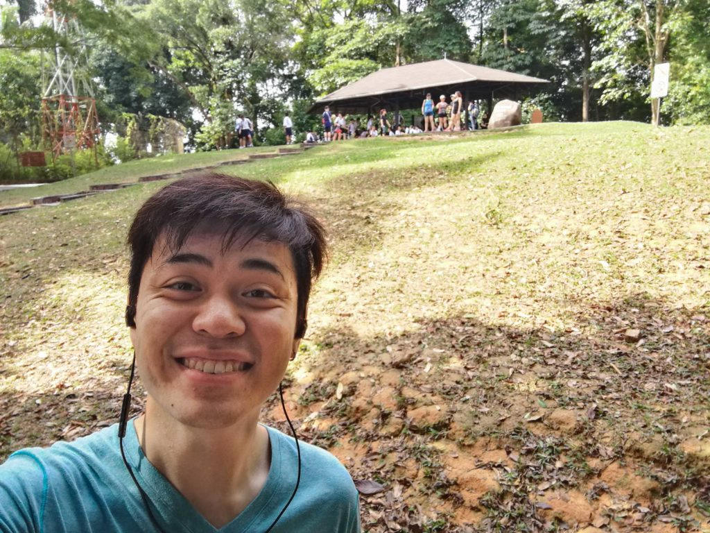

Programming is a precision sport. I've personally encountered--and many times have been the reason for--situations where an imprecise word is used to describe a line of code to another person, leading to confusion or worse, insidious misunderstandings that unravel only down the line.

Being deliberate with word choices is, in my opinion, mandatory as a programmer. Use the wrong word and risk conveying the wrong concept to someone fresher than you, or worse, wasting ungodly amounts of someone else's time building the wrong algorithm.

Over time, I've found some of the words that programmers use to be so precise that they exude a kind of beauty. The words programmers use frequently are typically not in the lexicon of an everyday person. More than a cool fact, I think these words have positive spillover effects on the way programmers communicate with one another and in general to friends and family. Let's just say that my French friends would be proud.

One of those interesting words programmers like to use is "agnostic."

> (noun) a person who believes that nothing is known or can be known of the existence or nature of God. (adjective) relating to agnostics or agnosticism.

First of all, wow. I had no idea the word is so entwined with the idea of God! (But before you get your underwear in a twist, let me just make it clear - I'm not discussing religion in this post, and I respect every individual's right to believe in any God that does not condone violence.)

Among programmers, the word is suitably used to refer to **libraries and tools that are built to be as close to neutral as possible in relation to associations with other technologies, libraries, and tools**.

For example, one would say something like "Backbone.js is **framework-agnostic**" to convey the idea that Backbone.js is a library that is designed to work with any of the plethora of frameworks currently available.

What a beautiful word!

### The hike and the question

 Me at the top of the tallest hill in Singapore - a staggering 164m!

Today during my hike down Bukit Timah Hill, Charlane and I bumped into a really fascinating guy called James. He sounds like he is about 55 years old but looks like he is 45, fit as they come.

We had a very interesting conversation about presence and Buddhism and how he quit his half a million a year job at 48 and started doing his life's work of volunteering and living life in his own terms.

At one point, James turned to me and said, "This is timely. There's this book I would like to recommend you to read."

"By the way, what's your religion?" he asks.

Here, I would like to lie and create a perfect story by saying that I replied with "I'm agnostic" but that would be wasted integrity.

"I'm a free-thinker," I replied.

"Ahh good. That will help you in reading this book."

I wish I used the word agnostic. It would have conveyed more; like how I don't think that God doesn't exist but I just don't know how to prove or disprove that he/she does or does not, and that I have basically made the decision to accept it as an open mystery in life.

The book was Eckhart Tolle's _The Power Of Now_, by the way.

The funny thing I'm realising now is that the word _agnostic_ really entered my vocabulary through programming, not religious zealousness. A word that likely originates from a religious institution gets adopted in a beautiful way by the programming community and finally finds its way into my tongue. Nice.
