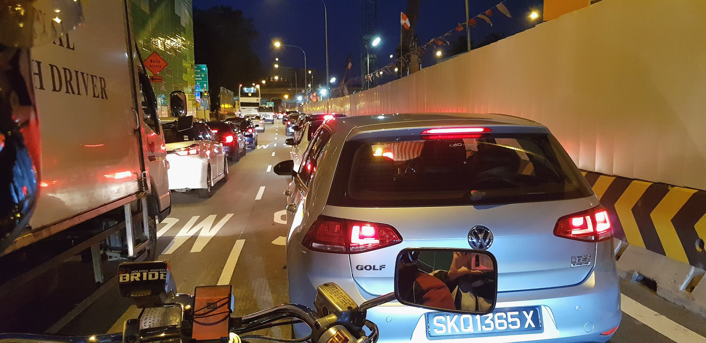

\[caption width="2999"\]Today's thoughts were formed while riding in the Singaporean traffic jam\[/caption\]

Among the many interviews I'm doing at the moment, none has been more involved than the one I'm going for tomorrow. I'll not reveal the company name for now since it's not much of a value-add, but don't read that as me saying it's a negative experience. It's not. It's just more involved than what is typical, which is fascinating.

Most job applications go through the same process:

1. Call with someone from HR - the "functional human being test" as my programming instructor used to call it
2. Online call to do live coding
3. On site to do white board coding, system design discussion, and discussion with a related team
4. Offer or rejection

That's the typical process I've experienced and it seems to tally with the ones many people are describing on Quora.

This particular company I'm interviewing at is different. It starts with a phone call with HR, but that's where the similarities end!

The second stage was a take home technical quiz. It was a riddle that starts from a single web page, goes through several clue discovery steps using browser debugging tools and shell scripts for firing sequential requests, and ends with an encoded string in need of deciphering. This was undoubtedly designed to test the candidate's proficiency in debugging and problem solving. Fair enough, and enjoyable too.

But then on to the third stage and I get a little thrown off balance. I'm expected to read up about a specific domain (online marketing) and be able to hold a fact-checked discussion with a team of Solutions Engineers (ie. customer facing engineers) about overall structure and flow of marketing and concepts in advertising.

Then, part two of this stage involved role-playing a Solutions Engineer. You're in a room with a CMO (chief marketing officer) and you're supposed to tell her what you think is a good way to spend her advertising dollars for the most ROI (or, as I learned, lowest CPA)!

Suffice to say, I did _not_ expect that.

Considering how most application processes go, this one is considerably more time consuming. And ultimately, that means many candidates are going to not match up to their expectations. At least that's what I thought (and still think)!

It's a lot to ask of a candidate - a person who is looking for a good engineering job at a great company. Great companies are hard to find but I think there are enough to keep one occupied during a job search.

Here's the point I'm trying to make: job searching is a full time job nowadays, especially for technical roles like software engineering, and dedicating a disproportionate amount of time for one application can be hard to justify.

I'm still strongly attracted to this company because of its customer-centricity and team culture. But I've also asked myself more than a few times whether I'm making the right choice sacrificing preparation time that will be applicable to all other other companies (ie. computer science concepts, system design, etc.).

The answer, I suppose, will reveal itself soon enough based on whether I get an offer.

Although I might then ask, what if I had spent all that time preparing and applied for the positions at companies I only dream of one day working at?

Life is a series of choices, and when one is made, a million others are relegated to the unknown. But we have to make them nonetheless. Dare we experiment!
