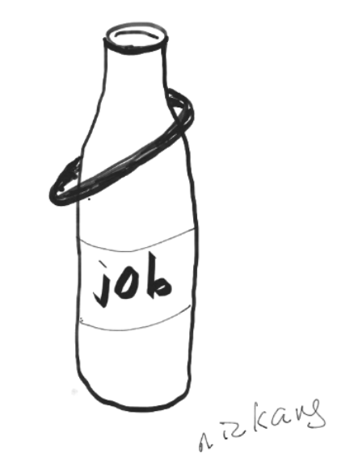

In an [earlier post](https://www.nickang.com/a-very-involved-job-application/), I lamented the fact that some companies have an interview process that requires very specific preparation. My main gripe was how it took time away from my preparation for other interviews disproportionately.

I'd like to now correct myself. I don't think that way of thinking is a good one.

I recently spent over 10 cumulative hours in the span of a week preparing for a product demo interview for a customer-facing engineering role. With that preparation, I managed to at least meet their expectations and I passed the interview.

While it is gratifying to know that hard work had paid off, if I were still thinking in my old way, I wouldn't be celebrating. After all, I had just spent 10 hours on a _single interview_ instead of 10 hours learning and practising material that will be good for 10 or 20 interviews at different companies!

The problem with thinking this way, I now see, is that it assumes that a job search is ultimately a game of numbers. But here's my recent revelation: job searching is not about the numbers.

You know those carnival games that involve you tossing a handful of plastic rings at glass bottles, hoping some will catch around the bottles' necks so you'd win a prize? Job searching, to me, is _sort of_ like that game. Let me explain.

https://www.instagram.com/p/BdFrNgeDVrV

There are a bunch of bottles huddled together in the middle of the table, but not all bottles are identical. The coloured ones are worth more (points) than the transparent ones. And the gold ones are worth more than the ones painted with a primary colour.

As a player, you can adopt one of two strategies:

1. Throw each ring randomly into the middle of the assembly of bottles
2. Throw each ring at a specific bottle that is worth more points

I know what you're thinking - who the heck will choose strategy #1, right?

Exactly.

This is why I'm realising how ridiculous it is to use that strategy with job searching! Some companies are worth more and others, less - so **why would I toss blindly into the centre and hope something sticks, instead of aiming and practising to get one ring in the shiniest bottle?**

This analogy between carnival game and job searching would be horrible if I'd failed to point out one crucial difference:

> In a job search, you only need one plastic ring to land on one bottle.

**A job search is not a game about obtaining the highest cumulative score - it is a game of jackpot.** Even if you got 2 offers, you can only work at one place at any time. And I imagine you'd want to pick the one that best fits you.

And so, the logic goes, if you spread your effort thinly by applying to 30 or 50 (or as I've heard some people recount, 100s) of companies, you're much more likely to get an average offer at a mediocre company.

If instead you choose to apply to 1 to 3 companies and focus your energy on getting remarkably good at your interview with them, you're much more likely to hit the jackpot when the gamemaster hands you that basket of plastic rings.
