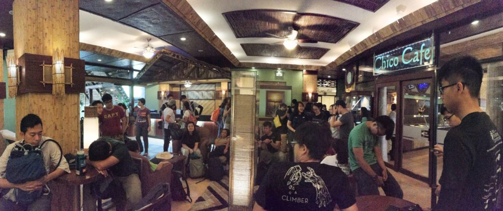
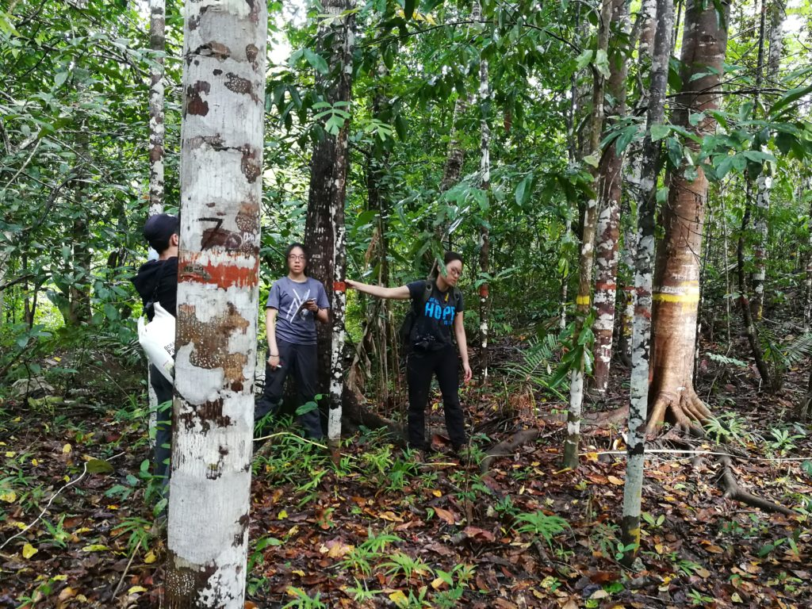
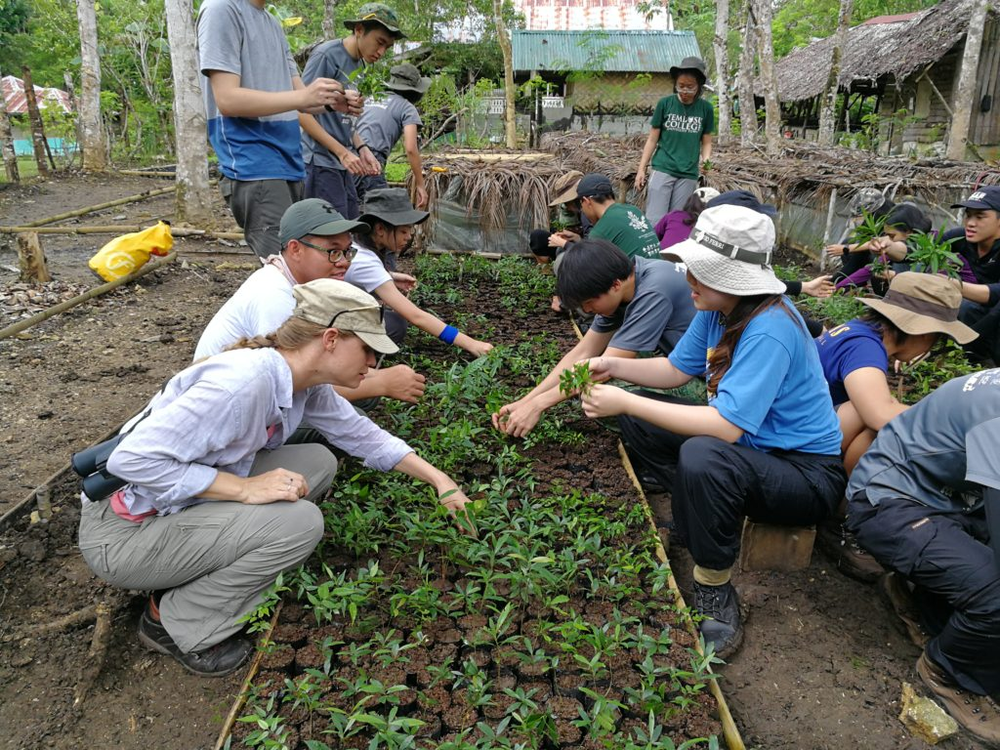
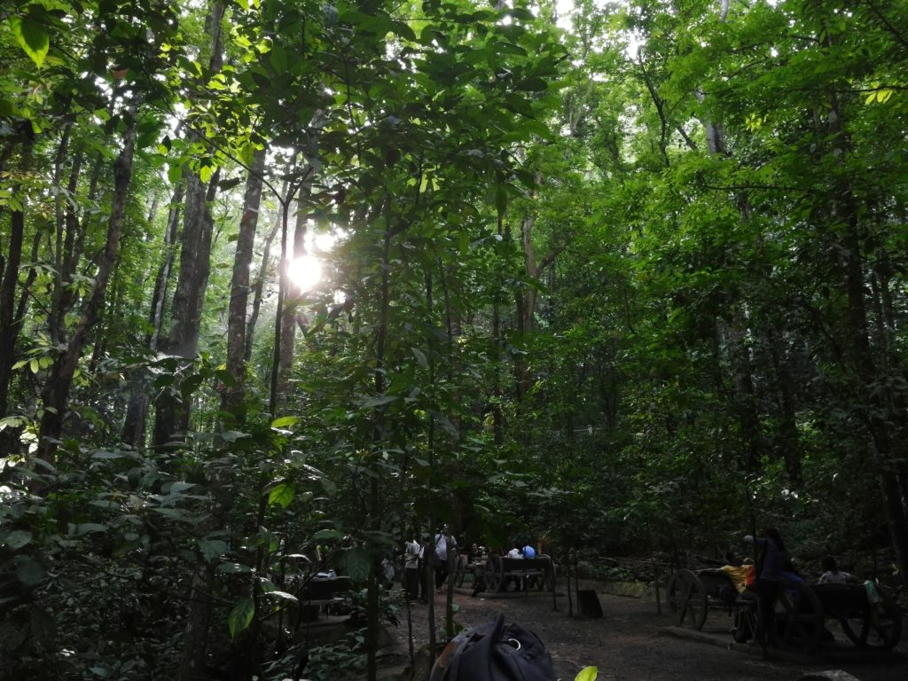

 Students of NUS BES in the lobby of Dao Diamond Hotel

I was in Bohol, Philippines as part of an overseas field trip at NUS involving 54 students from the Bachelor of Environmental Studies (BES) program from 17 May to 1 June 2018. I was there in an official capacity as a teaching assistant (TA), but deep down, I was really a student.

I was curious to find out how much I've changed since I last participated in the course three years ago. Would I still be able to relate to the kinds of environmental and social issues that the students were learning about? Would I care as much? What does my non-participation in environmental issues in my professional life say about me (to me)?

This short post is my post-trip reflection. They appear in no conceivable order. Oh, and photos are at the bottom of the post!

### Professional bubbles

Bubbles. Working adults all live in their own professional bubbles - environmental studies is one, tech is another. I expanded this thought into its [own post](/2018-05-21-professional-echo-chamber/).

### My disconnect from nature and wildlife

I'm surprised at how foreign nature and wildlife feel to me. It's always been like this for me, unlike for my newfound colleague and friend, Claire. Her closer-to-nature lifestyle is, in my eyes, more grounded than mine, which is built on business, technology, and social media.

I know _very_ little about nature. I can't identify trees or birds or insects by their species. I can't even differentiate the various _kinds_ of birds from one another, like starlings, herons, and even hornbills. Don't even get me started on how little I know about marine animals...

I find this inability problematic because, well, the world is teeming with life that I don't know much about. The only kind of life that I've so far been inclined to know about is human life. Naturally so, I guess, but it raises the question: how do people like Claire and Joanna, as well as so many students from the course (many of whom born in Singapore where I was born), know so much more and are so much closer to nature and wildlife than I am?

Speaking of being disconnected with things that humans used to be touch with, I realised on this trip that most Singaporeans (and maybe most urbanites) don't exert themselves physically much throughout a day. The only exception is perhaps at the gym. This is starkly in contrast with the people living in Bohol, Philippines, who exert themselves as part of their daily life, sorting waste, tending to their land, transporting goods to the marketplace, and so on. This is yet another way in which we, city folks, are separated from nature. Nature requires us to work, but we've outsourced most of that work to machines, computers, and other people by accumulating and spending capital.

### Stressed by stuff

I actually came home and felt stressed walking down the hallway. My mind felt jammed, constantly interrupted by things that are on the dining table, on the floor, and on the bookshelf, out of place. The 2 weeks away from home has given me a fresh view on the things that we own and put around the house - most of which I now realise are either unuseful of meaningless and probably cost some hard-earned money to be obtained.

I lived well in the Philippines without most of this stuff, so why should I still keep them around?

### Remembering things

Human memory is noisy and incomplete. I struggled to remember what Dao Diamond Hotel looks like on the inside but failed to do so. It all only came back when I stepped foot into the hotel once again, three years later.

### Random realisations

[_Imprinting_](https://en.wikipedia.org/wiki/Imprinting_(psychology)) is a real concept, not just fiction from Twilight! It's a concept in psychology, not biology, though.

Shifting gears, I'm reminded of how love is an incredibly profound experience. I felt extremely loved when two hotel staff remembered me from my visit four and three years ago (when I was a student and then a TA for the first time). The hotel we lived in is actually a non-profit organisation that employs people with disabilities, and in this case, both of them are deaf and mute. George and Jeriel communicated their affection through ear-to-ear smiles and enthusiastic hand-waving, and they melted my heart to my toes.

### Photographers and their irrational behaviour

Photographers can be quite irrational. Is there really any sense to take a photo of a tarsier, standing next to five other photographers with more or less the same camera setup as you?

I observed this behaviour at the [Tarsier Conservation Area in Bohol](https://www.tripadvisor.com.sg/ShowUserReviews-g1082590-d3833436-r546823931-Tarsier_Conservation_Area-Loboc_Bohol_Island_Bohol_Province_Visayas.html) (which, by the way, is a blasphemous name for a tourist attraction with very little regard for the individual tarsier's welfare and conservation). Assuming the photographers know one another, why wouldn't they just share the photos after the trip, and avail themselves to enjoying the moment?

My guess is that their seemingly irrational behaviour stems from the "mine" mentality. As in, a photograph isn't mine unless I shot it myself with my own equipment. This "mine" mentality might be rooted in fear (of not having true ownership of a photograph). From an observer's point of view, it just seems so wasteful of a beautiful, fleeting moment.

## Next

Life in the past 4 months has been exhilarating, and with this trip behind me, I'm now entering a phase of slightly more stability.

I will be starting a new job as a Service Operations Engineer at [Smartly.io](https://www.smartly.io/) tomorrow. I'm overflowing with excitement to be part of a growth stage startup for the first time. From what I can tell, we have a great product that some of the world's largest online advertisers rely on for automating their marketing campaigns. And perhaps more importantly, I'm energised by the prospect of being part of an A-team with a company culture that is unlike anything I've seen so far, and in good ways.

Tomorrow, I'll be flying to Helsinki, Finland, where the company is headquartered. It'll be my first time in the country, and I'll be there to participate in a company-wide strategic offsite. Will write more from the ground and publish them here soon!

### Photos from the trip

 Most likely on their final ride...

 Filipino tricycle! Complete with a driver who clutches change between his fingers. Classic.

 Doing a forest survey

 We transplanted the "wildlings" that we uprooted from the Raja Sikatuna watershed to the nursery at Bohol Biodiversity Complex

 Dr Joanna Coleman in her element picking parasites off a bat

 Me, enjoying the sunset at the Bohol Biodiversity Complex

 Bohol man-made forest
