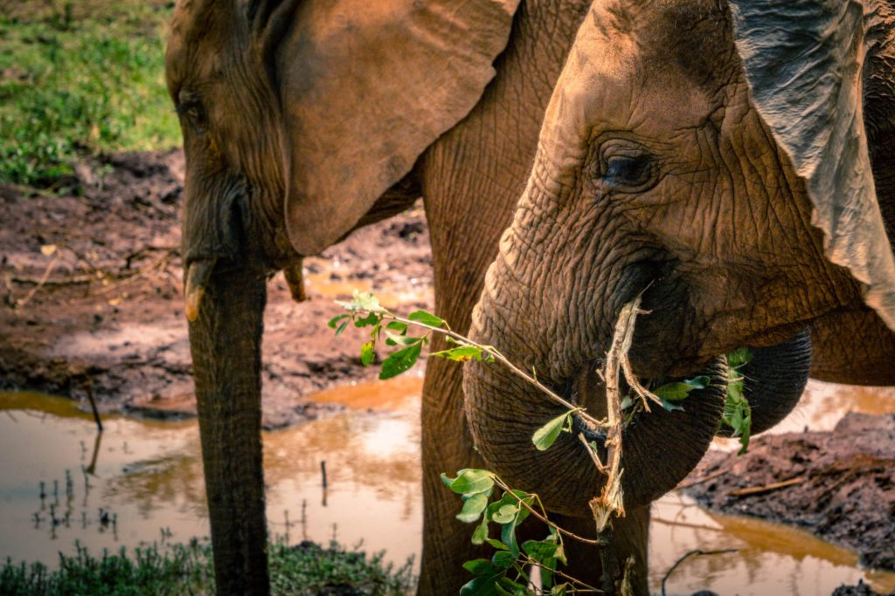
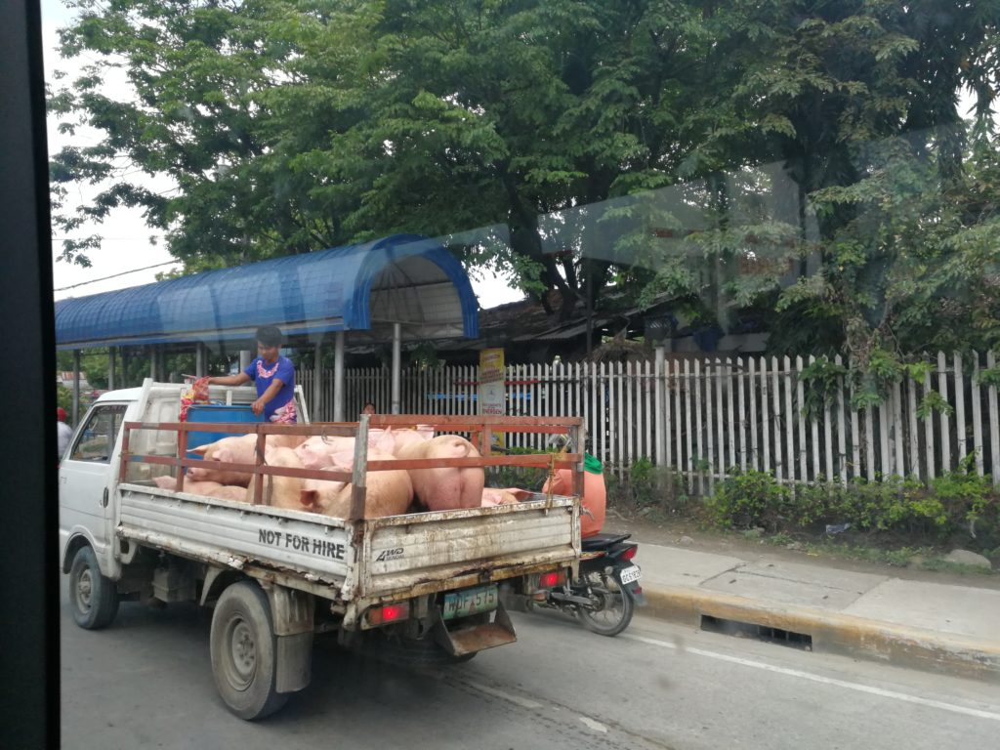
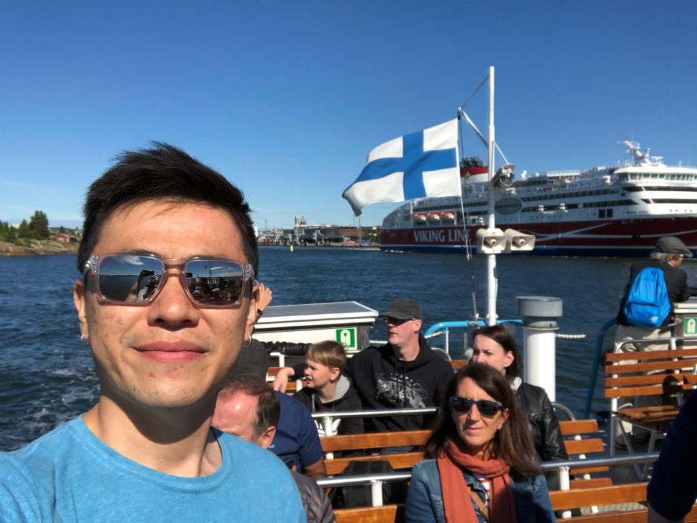

 Photo by Alex Mercado on Unsplash

It's official. Well, sort of. I'm going vegetarian! For a month, for now. To know how I went from omnivorous all my life to seriously trying to be vegetarian, I'll have to do a bit of storytelling.

As far as I can remember, it all began somewhere on the highway of California - sometime in 2013.

### The Californian highway

I was driving a Chevy convertible (free upgrade from Hertz) with my then-girlfriend-now-wife, Mei, having the time of my life. At some point, Mei noticed a huge field with more cows than we could count. It was an interesting sight since we don't see cows at all in Singapore, and it was an innocent observation on our part.

Until we noticed a huge metal shed next to the cows. It was really big, stretching possibly for 500m in length.

This shed was connected to the fields that we now realised was gated by a long fence. What else could it be, other than a slaughterhouse?

At that moment, after a short but powerful discussion about animal cruelty, Mei swore off beef. There and then she said she would never eat beef ever again.

Neither of us had restricted ourselves from eating anything out of the ordinary before that. Chicken, pork, fish, and beef were all regular parts of our diets. So for Mei to have committed to abstinence of beef on the spot, and follow through till this day five years later, was a mighty show of willpower and a testimony of the power of experiences.

That slaughterhouse was opaque, but passing by in our vehicle that so much represented freedom, we felt the suffering that was happening behind those walls, and at least for one of us, it was enough.

Several years passed, and Mei dutifully kept her promise to never eat beef again. Meanwhile, I was still enjoying the occasional steaks, as a standalone dish or as part of a burger. To be honest, it was mostly McDonald's - so cheap and good.

The only effect that Mei's abstinence has had on me until now was that it made me cut down my beef consumption roughly by 50 percent. I didn't want to eat beef around her because deep down I knew that it would make her uncomfortable.

### Anthony Bourdain killed a red stag

Several years later in 2016, while I was on a flight to Hong Kong for a short holiday, I saw a beautifully filmed episode of [_Parts Unknown_](https://explorepartsunknown.com/) hosted by the late Anthony Bourdain. That episode [made me realise](https://www.nickang.com/killing-meat/) how big a coward I was for eating meat that I didn't hunt and kill with my own hands. All I can say is that I now understand how thinking lowly of yourself can prime you for change.

(By the way, I still can't believe Anthony Bourdain took his own life. I loved the man for his messy mix of candour, conviction, and brashness.)

Then, in May 2018, I went to Bohol, Philippines with 53 students from my alma mater (the National University of Singapore, NUS) as part of an overseas field trip program. There, seeds of vegetarianism were sown into my unsuspecting mind.

### The Filipino truck

Many things happened in Bohol. I'd been to Bohol twice, and this was [my third time there](https://www.nickang.com/philippines-field-trip/). When you go there with people from the Bachelor of Environmental Studies program, Bohol becomes a big petri dish for learning about nature and society.

Aside from farm visits, early morning bird watching and late night "spotlighting" activities, and the fascinating marine and forest surveys that we conducted, it was the conversations I had with people during the trip that made me think about my relationship with meat.

One of my fellow teaching assistants (whom I regard to be much more qualified than I am to be helping to teach this course) was Claire. Unsurprisingly as you might already be thinking, Claire is a proud vegetarian. Not in a pushy way; more like an independent and self-confident way.

I'd notice that out in the fields, Claire would have great dexterity and stamina - something I somehow assumed vegetarians wouldn't have.

It's weird. I'd always unquestioningly believed that vegetarians have less energy than omnivores, a notion that I'm unable to trace to its inception in my foolish mind.

Claire demonstrated a simple fact: just because a person only eats vegetables, fruits, eggs, and milk does not mean that she would be any physically weaker than someone who also has chicken, pork, fish, and beef in her diet.

Another thing I liked about Claire was her conviction. Although she doesn't judge people who eat meat, she's always ready to share why she chose this lifestyle when asked. This is a trait that all people whom I eventually grow to respect have: a quiet conviction of one's beliefs and choices.

Being vegetarian is still a somewhat contrarian thing to do, and being anything contrarian requires a great deal of self-confidence and self-control. Anyone who is able to command him or herself to stand by his or her beliefs and act accordingly is incredibly sexy to me. (Ask me why I'm so attracted to my wife and I'll tell you about her convictions!)

As our field trip in the Philippines drew to a close, something happened as if by fate to compel me to seriously think about not eating any more meat. A small truck with about 20 pigs packed into its rear drove next to our coach on the way to the Mactan-Cebu airport.

 The final ride

I knew it was these pigs' final ride. At that moment, all I could think of was all the pork I had eaten in the past two weeks.

Exactly two days after I got home from the Philippines, I was on a flight to Helsinki, Finland, to kickstart my new job with some onboarding training and a perfectly timed bi-annual company event.

The beautiful Finnish summer was really when the seeds of vegetarianism that were planted in my head in California and Bohol sprouted into saplings.

### The Finnish work holiday

 Island hopping in Helsinki

The final act before I became a vegetarian takes place in the beautiful, understated city of Helsinki.

I've been here for the first three weeks at my new job at Smartly.io. It is a company full of amazing people. I heard one of my colleagues put it this way: we work as a pro sports team, constantly working out to make the organisation more respected, profitable, and functional.

Not too surprisingly, this company has a very high percentage of people who are either vegetarian/vegan or have considered becoming one. People with conviction!

Also, as a side note, Helsinki is a great place to consider becoming a vegetarian. Almost every single restaurant I've been to here has at least a few really tasty vegetarian dishes, and a lot of people are incredibly empathetic and even admire those who have made the choice to become one.

Speaking of people, in the three weeks that I've worked and sort-of-holidayed here, I've had numerous conversations with mostly colleagues (50 out of 200+ of them) and I can easily group all of their reasons for being or contemplating becoming a vegetarian into one of two categories:

- I understand how we actually obtain meat, and I can't stand for being a part of that
- I know the science behind eating meat (it's much healthier to have a meat-free diet), so I'm/want to be vegetarian so I can feel better and be healthier

One of my colleagues, Khaled, who had been vegetarian for four months and vegan for a month before re-introducing meat into his diet, mentioned a documentary that he'd watched. He credited it for nudging him to experiment and recommended that we watch it.

I watched it, and it was the straw that broke the camel's back.

Here's a summary of the things that stood out to me from [_What The Health (2017)_](http://www.whatthehealthfilm.com/):

- All protein comes initially from plants via photosynthesis - we don't need to obtain protein one-degree removed from its source!
- The largest animals in the world eat are herbivores! (eg. elephants, rhinos, gorillas)
- Inflammation ensues immediately after consuming meat - this doesn't happen when you eat vegetables
- Diabetes, one of the biggest killers, isn't caused by sugar (carbohydrate intake is _inversely_ correlated to diabetes) - many, many studies conclude that it is caused by meat-based diets
- Diabetes means on average taking 19 years away from a person's life
- Drinking one cup of dairy a day increases the risk of prostate cancer by 34 percent in men
- Countries with the highest consumption of milk correlate strongly with levels of osteoporosis
- Many non-profit organisations are actually fronts for pushing the agenda of meat producers (who grow and sell meat) and big pharma (who sell a lot of antibiotics and other drugs to meat producers - this is, in my opinion, incorrigible behaviour that should not be encouraged

The central theme of _What The Health_, as you might imagine, is that we've deliberately been misled by bad actors to believe that we need to eat meat to have a healthy body when in reality, the reverse is true. Not eating meat is actually one of the best things you can do to lead a healthy life.

### Going vegetarian

So why am I going vegetarian?

I'm going vegetarian because I want to be healthy. Stronger, less sick, and greater vitality.

I'm also going vegetarian because I want to stop supporting animal farming operations so we reduce our violence and inhumanity towards these animals that we seem addicted to eating.

It's time for me to take a firm stand on this issue. I've been cowardly all this while not daring to face up to this important issue. Now that I'm in great company, I'm going to commit to being a vegetarian!

* * *

_Friday, 22 June 2018 in Cafe Tori at the Helsinki Airport._

* * *

_Liked this post? Hated it? Agree with some points but vehemently disagree about something? Let me know why by leaving a comment. Let's talk. (Also, if you loved it, consider subscribing to my monthly newsletter so you don't miss all the good stuff that's coming this way.)_

_PS. Actually, I'm also still contemplating between being full vegetarian or pescatarian (a vegetarian who also eats fish). We may need to discuss the morality of fishes vis a vis that of mammals at some point..._
