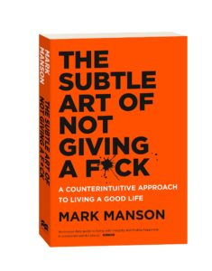
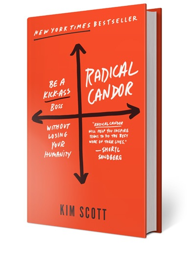

Recently I was back in the military for training. This time it was in Australia and a handful of us conscripted soldiers coincidentally had a personal book in tow. Just in case there's ever a "rush to wait, wait to rush" situation. There was.

One of the more popular books among the crowd, which I later found out was at number 1 on the bestsellers chart in Australia, was _The Subtle Art of Not Giving A Fuck_ by Mark Manson.

I had listened to the audiobook a year ago and I remember poignantly that the author proclaimed that there are limited fucks we can give in our short lifetimes. And if we give them out for free (as we do by default, according to him), we'd have none left for the times that need them.

Bear with me, I'm getting to my point soon. First, I need to first mention another book I'd recently skimmed through. It's called _Radical Candour_ by Kim Scott.

\[caption id="attachment\_2954" align="aligncenter" width="386"\] Radical Candour happens to be a book that we live by in Smartly.io\[/caption\]

One of the core theses of the book is that great teams are created and held together by radical candour. And it goes, if you don't do radical candour (ie. give feedback no matter how awkward or painful it will be, so that people in your team continually improve and work better together), the next best thing you can do is be an asshole.

This idea is extremely powerful and warrants a quick explanation. What the author is saying is that if you're somehow unable (or unwilling) to be radically candid with your coworkers, the next best thing you should do is to screw politeness and just say what you need to say without fear of looking like an asshole. This way, at least you have a good chance of getting the feedback across, which is much better than keeping it to yourself or worse, talking behind people's backs or being passive aggressive towards that colleague.

What's really neat about this "be candid or be an asshole" framework is that there's a clear guide to choosing one or the other. Decide based on how much you care.

### Combining the two

What I realised recently was that if I care enough about the person and/or the team, I should try to be radically candid and provide feedback. I should carefully craft the message but deliver it boldly and personally. It's for the good of that person, and since I care for him/her, I should try to deliver that feedback.

But if I care for the team but not enough for the individual, it's ok to opt for the second approach, which is to be an asshole and try and get the message across anyway. This is a hopeful play since it ultimately depends on how the person receives it. But if I don't care enough, it's the most I'm willing to offer. Take it or leave it.

Whenever we give a fuck about something and act on it, we have effectively decided to walk the long road to battle.

This time in Australia, I had a bad experience with a coworker (should I call them that in a military setting?) and I decided that I didn't want to give a fuck (read: I didn't care enough about him as a person). So I was an asshole to this person, delivering the message and leaving for greener pastures (literally in this case). I saved myself the trouble and pain of the battle and took a slow hike alone instead.

In reality, this looked like me telling the person that I can't work with him because he's unbearably defensive about everything. Once I've said it, everything else he retorted with became mere noise to my ears.

I'm happy to declare it an internal victory. I did, after all, save myself one little fuck.
