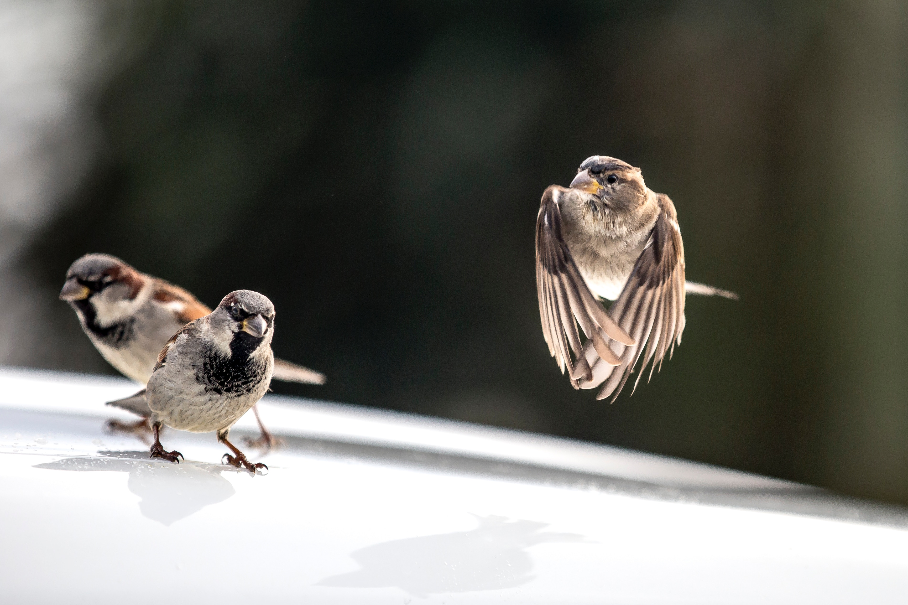

Yesterday my wife and I launched our first [business](https://angveilyu.com) together. It's so new at this point that our revenue is still, well, zero.

But in the lead up to our official launch yesterday, which culminated in a simple launch party with a select group of friends and trusted industry professionals, we had already done some work. Here are some of the lessons I've gleaned from that work that led up to the launch party.

### Secrecy creates mystery, mystery brings people

Secrecy creates mystery and it's worth the effort. When you withhold information about your new business, the mystery created seems to compel people to come for your event.

We invited 24 close friends to our launch party and all replied “yes” and only 3 ended up being unable to make it. That’s a greater than 85 percent invitation success rate, which is fantastic in my books.

### Setup an Instagram account early

Whether or not your business is highly visual, Instagram has a role to play in today’s business landscape. More and more marketing happens on social media, and Instagram seems to have taken the throne.

We had about 15 followers before the launch party, most of them friends whom we’ve chosen to tell our secret to, and some were collaborators like our photographer, videographer, florist…

During the launch party, we gained about 40 new followers despite there being only 21 people at the party. When I checked this afternoon, we already had 160 followers.

The thing is, many of our friends who were at the launch party shared photos and videos on their Instagram Story. Because our [@angveilyu](https://www.instagram.com/angveilyu/) account was already set up at the time, it was easy for them to tag us in those uploads.

Once someone tagged our account, Instagram automatically made the tagged content one-click shareable from our account inbox. **That means we've effectively crowdsourced our event photography**.

We would have missed out on all of this high-quality following if we’d forgotten or been slow to set up our Instagram account.

Finally, another advantage I’ve noticed of setting up our Instagram account a month before the launch event is that it gave me time to establish the brand aesthetic and tone with a few, spaced out posts. It was good practice in a low stakes environment (since there are only a handful of followers).

I believe that having a few existing posts also makes it an easier decision for people to follow the account. Completely new accounts don’t, or I should say can’t, make an impression.

### Make events Instagrammable

https://www.youtube.com/watch?v=58lP2LXJESk

Owing to my wife’s foresight, we made sure that there was an area that was set up with a beautiful backdrop, decent lighting, and space for guests to stand around to take photos at. Many photos from that night were taken there, and they all look great and most importantly, on-brand.

In other words, I found it worthwhile to invest in constructing an "Instagrammable" corner. This is particularly important for businesses that are highly visual.

### Grow together with other businesses

Dare to ask for collaboration and be sincere when giving them shoutouts after the event.

Collaboration naturally only applies if you’re launching a business that is in the same industry or has a significant overlap with your existing business/profession; because otherwise, you wouldn’t bring value to them.

For us, my wife’s network of friends in the wedding industry made it easier for us to collaborate with other up-and-coming businesses.

We had preferential rates (some even with no cost) for flowers, event space styling, food, gown, photography, and videography because these vendors were able to trust that we will grow and bring them along when that happens. As the saying goes, a rising tide lifts all boats!

### Setup analytics to gather data early

Similar to setting up Instagram early, I found it valuable to set up tracking on our online store early. I installed the [Facebook Pixel](https://www.facebook.com/business/learn/facebook-ads-pixel) and [Google Analytics](https://marketingplatform.google.com/about/analytics/) code on our store early and now I’m already starting to peek into the data to understand user behaviour and preferences.

## More business posts are coming

Earlier this year, shortly after I joined [Smartly.io](https://smartly.io) as a Service Operations Engineer, I said I was going to write [more marketing-related posts](/2018-06-16-much-marketing-topics-blog/). Back then, I had no idea how difficult it was to talk about marketing without practising it. Not many posts came out of that declaration.

This time, things are a little different. One of the reasons I’ve joined my wife on what is mostly her business (since _she_ is the one who understands our product and potential customers’ needs) is to be able to learn about marketing by being fully in charge of it for a business. In my opinion, firsthand experience is crucial if one is to be good at something.

Marketing has always fascinated me but I’ve never had a good opportunity to get my hands dirty and try things out. Now I have a great one and I don’t intend to waste it.

If you’d like to follow me as I try to grow ang veil yú into a successful small business, covering topics like marketing, branding, customer experience, being in business with your life partner… and more, I highly encourage you to **subscribe to this blog**. That way you’ll receive an email every time there’s a new post.

* * *

\[blog\_subscription\_form title=""\]
