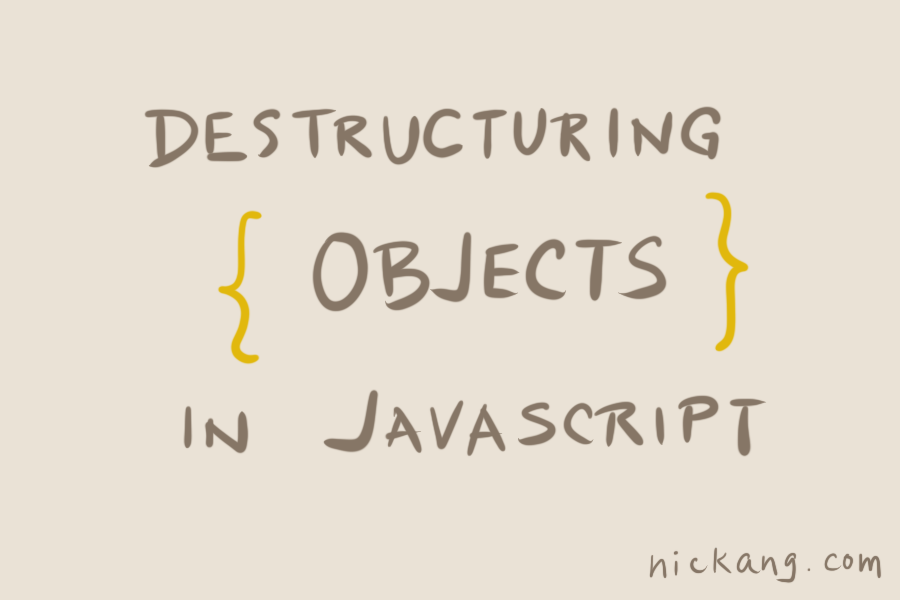

ECMAScript 2015 (or ES6 as it’s more popularly known) is now mainstream and supported in all major browsers. With that, destructuring becomes a standard feature of JavaScript.

Before describing how you can use it, let’s talk about why destructuring is a useful feature of a programming language.

### What is “destructuring"? Why use it?

Most of the time in JavaScript, we work either with an object or an array.

When working with an object, there are usually many key-value pairs. And sometimes within a certain function scope, we would have to frequently use one or two of those values stored in keys of an object.

For example:

```js
const person = {
    name: 'Joe',
    email: 'joe@doe.com',
    phone: 90101010,
    address: '...',
    age: 29,
    occupation: 'software engineer'
}

const getBasicProfile = function(user) {
    return `${user.name}, age ${user.age}, is a ${user.occupation}.`
}

// run
getBasicProfile(person)

Another potentially clearer way to write `getBasicProfile` is to introduce intermediate variables and assign those values to them before the `return` statement, like so:

const getBasicProfile = function(user) {
    const name = user.name
    const age = user.age
    const occupation = user.occupation

    return `${name}, age ${age}, is a ${occupation}.`
}
```

Lengthier, but much more readable. In terms of performance, introducing 3 temporary variables will **not** slow down your runtime in any significant way. Read more about [code readability versus efficiency](/2018-11-16-code-readability-or-efficiency/).

Anyway, this pattern of picking apart a passed-in object repeats very often. One consistent use case is when using external libraries like React and its plethora of related libraries like React Router, Prop-types, etc.

The solution? Destructuring!

### Destructuring objects in JavaScript

Here’s an example of destructuring at work using the above example:

```js
const getBasicProfile = function(user) {
    const {
        name,
        age,
        occupation
    } = user

    return `${name}, age ${age}, is a ${occupation}.`
}
```

What just happened?

- `user` object was destructured
- The keys ‘name’, ‘age’, and ‘occupation’ stored in the `user` object are now independent variables of the same name within the scope of `getBasicProfile()`
- No need to repeat `user.xxx` to point to each value that you need from an object - just destructure it into its own variable

This makes JavaScript code much cleaner (less overall repetition) and, as I’ve used it a lot recently at work, I’ve realised that it also positively impacts the way I name keys in objects that get passed around. _Will this key naming make sense when it’s restructured into its own variable in a function later on?_

If this concept is new to you, or it’s new to you in the JavaScript language, I highly recommend you to use it.

### Destructuring into a different variable name

Now, what if for some reason, you wanted to assign the value of `occupation` key into a variable named `title`? In other words, how can you rename variables when necessary?

That’s possible and quite easy to achieve:

```js
const getBasicProfile = function(user) {
    const {
        name,
        age,
        occupation: title
    } = user

    return `${name}, age ${age}, is a ${occupation}.`
}
```

Now, `title` will hold the value of `occupation`, and the latter value is `undefined`.

### Destructuring nested objects

Now what about objects with nested objects? Can they be destructured?

Yes they can!

Let’s say our `person` object gets a bit more complex, and the ‘address’ key now contains an object instead of a string:

```js
const person = {
    name: 'Joe',
    email: 'joe@doe.com',
    phone: 90101010,
    address: {
        addr1: '...',
        unit: '10-10',
        postcode: 123456,
        country: 'Singapore',
        city: 'Singapore'
    },
    age: 29,
    occupation: 'software engineer'
}
```

To do a nested destructuring to get to its city and country:

```js
const {
    address: {
        country,
        city
    }
} = person

console.log(city, country)
// Singapore, Singapore
```

A word of caution here is that this can get a bit hard to read. The beauty of destructuring, at least to me, is that it actually _looks_ like it’s un-compacting an object and selectively taking certain values out and creating their own variables in a scope.

Nested destructuring, on the other hand, quickly starts to look like it is constructing its own object instead of picking apart an existing one.

My opinion? Try it for yourself and see if you’re comfortable seeing nested destructuring code. Otherwise, you can always do a second destructuring to keep your code look simple:

```js
const { address } = person
const {
    country,
    city
} = address

console.log(city, country)
// Singapore, Singapore
```

I wouldn’t use nested destructuring on objects that are 3-levels deep (ie. an object in an object in another object). That would just be unreadable code.

### Destructuring with default values

```js
One last great thing about destructuring is that you can assign a default value if a particular key doesn’t exist in the object being destructured:

const person = {
    name: 'Joe',
    email: 'joe@doe.com',
    phone: 90101010,
    address: '...',
    age: 29,
    occupation: 'software engineer'
}

const {
    age,
    name = 'unknown',
    gender = 'unspecified'
} = person

console.log(age, name, gender)
// 29, 'Joe', 'unspecified'
```

This is particularly useful when working with databases that might have gaps in the entry in making sure that the front-end can work independently with the data by assigning sensible user-facing default values.

That’s all there is to destructuring objects in JavaScript. Happy coding!

