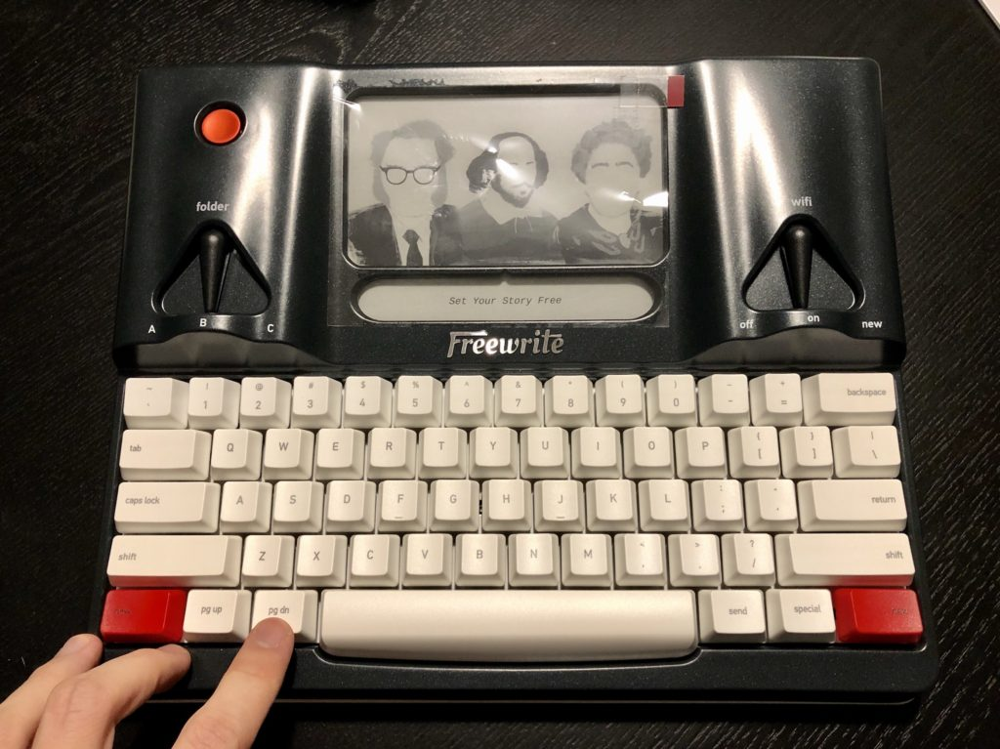
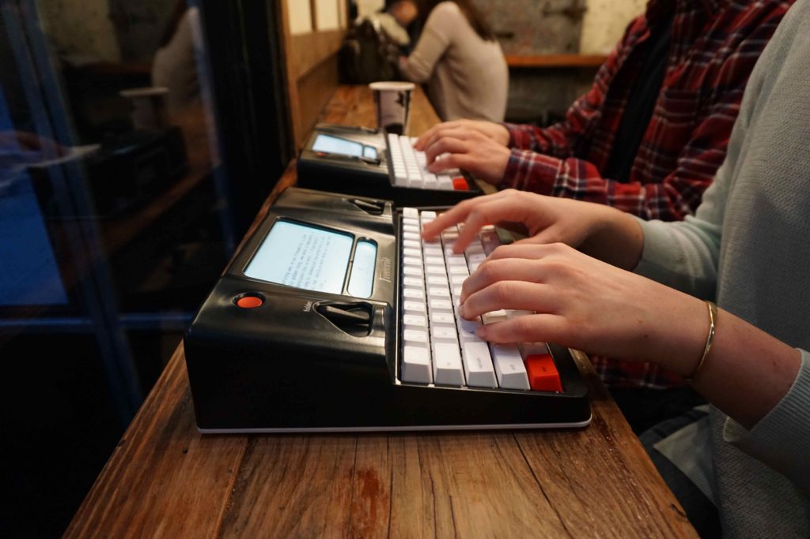
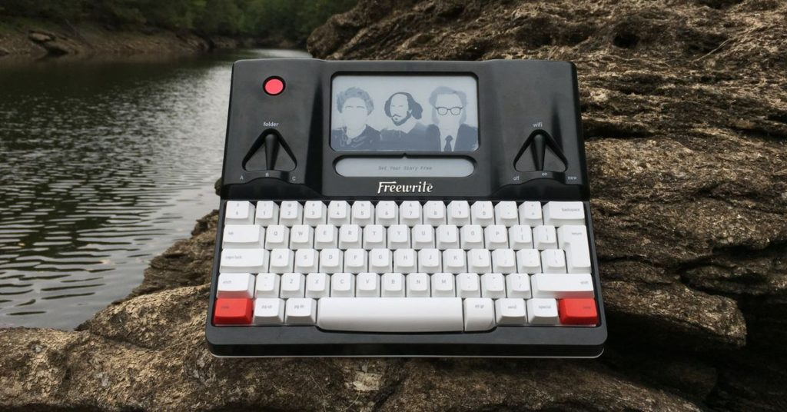

 My Astroahaus Freewrite fresh out of the box

Hello, you. I want to tell you about the Freewrite, a device that I hold very close to my heart because I've _always_ wanted something like it. In fact, I started working on this as a one-man startup in 2014, at about the same time as the guys at Astrohaus did. They were just a lot more technically capable than I was. Instead of building my tech product, I shelved the idea after 9 months of working on it and went back to school to [learn programming](/2016-08-16-general-assembly-singapore-web-development/).

And now, things have come full circle. Although I'm not writing this on a Flowriter (what I would have called my product if it existed beyond prototypes), I _am_ writing this on a distraction-free specialist writer's tool. I'm writing this on my very own Freewrite, which came through DHL this evening to my apartment in Berlin.

While my memory of using this device for the first time is still fresh, I wanted to get my first impressions down in words for future reference. I might change my mind in the future. Also, perhaps this could be useful to you too if you're considering getting an Astrohaus Freewrite for yourself.

## Doing one thing really well

First, the premise. Why did I spend SGD 800 to buy a Freewrite? That's a hefty price tag for anything, let alone an inferior laptop. SGD 800 is about 500 EUR, for reference.

I was willing to spend a large chunk of my monthly paycheck on this machine because I knew this would be one of the best investments in my life as someone who loves to write. Why am I so sure? Because that's virtually guaranteed by a device that only does one thing: allow you to write. Heck, even a blank sheet of paper could be a bigger distraction than this device if you are an origami enthusiast.

I spent money to buy this device because I wanted to write more. (Plus, it's Christmas time.) It's too early to tell if I will reach that ultimate goal of writing much more, but I can already talk about a few good and bad points about this device since I have it literally at my fingertips. Let's go.

## Truly distraction-free writing

When you write on a dedicated writing device like this, one thing becomes immediately clear: there's nothing to fiddle with and it is a useless device to you unless you write. If you are fed up with writing, you just have to put it down and go do something else. It has nothing to offer you in those situations!

But this device is magic when you _are_ in the mood to get your thoughts out from your mind into words. I have a satisfied smirk on my face as I write this blog post because I know I'm in-distractible right now. The Freewrite is sitting on my lap, its weight acting as a natural deterrent from me getting up and picking up my phone to check Twitter or my email, which I've already thought of doing a few times now. Nope, not happening until I'm done with this draft!

This is refreshing because I've tried every alternative you can think of, and they're not _truly_ distraction-free at the end of the day.

For example, I've used apps like [Freedom app](https://freedom.to/) that are designed to disable your laptop's WiFi module for a predefined amount of time to simulate a distraction-free writing environment. I thought it would transform my old Macbook Air effectively into a Freewrite, but I overrode that software inhibition all the time. Knowing that there's a door out, I always walk out the door when I feel stuffy in the room. It doesn't help that I am a software developer and can guess how to bypass apps like that to get my laptop back into normal internet-ready mode.

With the Freewrite, I wouldn't know how to hack it to have a web browser, so I wouldn't even try. I have poked around the limits of this device to see where the boundaries are in relation to internet-related distractions and so far, I haven't found any. Syncing of my drafts happen in the background so I don't even see updates on the screen. Unless you find hitting the dedicated "send" button, which sends the current draft to your email fun, there's nothing interesting here.

## No cursor means no editing while drafting

This probably applies most to people who are conversant with keyboard shortcuts. Since I learned to code and became a software developer, I haven't been able to type without using shortcuts like Alt + Backspace to delete the previous word instead of deleting character by character, or Cmd + Backspace to delete the full line. It just feels too inefficient, so I never do single backspaces or arrow keystrokes. Here's a sample of the keyboard shortcuts that I use every single day at work on my laptop:

- Highlight multiple lines: Cmd + Shift + Left + Up
- Jump to top/bottom of document: Cmd + Up/Down

These shortcuts have improved my productivity a lot and it has allowed me to draft articles in a fundamentally different way. However, they're very distracting.

For example, if I see that I _could_ insert a new sentence just before this one to make the post read better, I would just hit the arrow keys and move around and start writing a new sentence elsewhere. Or if I wanted to shift an entire written paragraph to be above the previous one, I could achieve that in just 3 keystrokes, and I almost never hesitate to do it. I've even caught myself sometimes doing this just to see and feel what it's like if the position of that paragraph was switched! Little neuroses like these add up and they end up severely impeding my drafting progress. Your mileage may vary.

Without arrow keys and therefore a lack of a movable cursor on the Freewrite, I'm liberated from the tyranny of efficiency. So far, I like this omission very much. I'm already seeing how little value those efficiencies bring to me when I'm trying to draft. That's a creative process, and constraints improve, not impede creativity.

## The control panel is elsewhere

Get this: there are only three font size settings on the Freewrite! And you know what's better? They are tucked away on their web app. Yes, you have to leave your Freewrite, pick up your phone or laptop, visit their website and select and save the setting you want.

Is this mostly a good or bad thing? I'm undecided on this point at the moment because I can see practical reasons to be able to increase and decrease font sizes, like in the evening when it's dark, I'd prefer a larger font size and in the day, a smaller one.

It seems that this was by design, and I appreciate it for that reason alone. I mean, crucial settings can still be toggled from the Freewrite itself, like the backlight. Whenever I want the light to come on, I just toggle it with Special + L and it comes on instantly.

Everything else? Go to the web app. But hey, that will disrupt your flow, so perhaps you might want to just stay focused and write what you wanted to write.

## A real keyboard

 Image by Astrohaus

Typing is not a natural act. We learn, increasingly younger, how to type on a computer keyboard. But to me, till this day as a writer and programmer, I still find typing as unnatural as wearing a tie. And this is one of the reasons why an ergonomic keyboard makes such a big difference, and the Freewrite's keyboard delivers.

There's not much that I need to say about the keyboard other than it is made of [Cherry MX Brown switches](https://www.cherrymx.de/en/mx-original/mx-brown.html), which is the industry standard for mechanical keyboards.

Each keystroke is audible and your finger with comfort and satisfaction. No unsatisfactory rubber membrane feeling that sends small vibrations up your fingers. If you have ever used a mechanical keyboard, you'd know what to expect from this. No surprises here, just delight!

I'd say the only drawback to a mechanical keyboard is just how audible they can be. The decibels are somewhere in between that of an older Macbook Air's membrane keyboard and the newer scissors-switch keyboard. Thankfully, my wife is tolerant of this sound. It may have something to do with the fact that I used to own a mechanical keyboard with Cherry MX Blue switches before, which produced extremely satisfying clickety-clacks with each keystroke, but gave her migraines. The Brown switches on the Freewrite are really gentle sounding by comparison.

## Solid build

I really like the weight of this thing. Carrying it by the handle is really easy, and it feels just like holding a 15-inch Macbook Pro in a leather suitcase.

The weight is important to me because I often sit on the couch and write. In that position, I'll rest the device on my lap or put it on the couch atop a cushion to write, and the weight keeps it from wobbling with my stabbing keystrokes.

Knowing it weighs something also helps me think of this device differently than if it were light. I remember how the earlier Samsung smartphones used to weigh much less than their iPhone counterparts and I've always subconsciously associated that lightness with cheapness. I want something that feels like cast iron and indestructible as my main writing device, not something that feels like it is made of corrugated plastic.

## No more eye fatigue

The screen on the Freewrite uses e-ink technology. This is a game-changer. When I was trying to build my own version of the Freewrite (remember my startup story?) I used to tell people what the device is supposed to be: a laptop for writers. But it wasn't precise enough and curious people often asked me about what form factor and features such a device would have.

Then, one day, I decided to talk about it differently. I said, "It's like a Kindle for writers." Everyone understood exactly what I meant from then on. That saved me a few hours throughout the remaining months I worked on that startup.

A Kindle for writers. An e-ink display. Yes!

Staring at a laptop at work and then coming home to try and write on another laptop - that can be quite [taxing on the eyes](/2019-02-18-eye-strain/). I know it and have [complained](/2019-10-16-sick-of-looking-at-a-screen/) more than once about this.

E-ink is much, much better because it is optionally back-lit. If you had enough light around you, you'd never use the built-in backlight, and that really saves your eyes.

What about latency on the screen? This was one of my biggest concerns when I was considering the Freewrite. What if the screen lagged as I hit the keyboard and couldn't keep up to my typing speed?

I'm not sure what to tell you at this point: there is a definite latency on this e-ink screen. Don't expect characters to show up instantly on the screen as you would experience with any laptop screens. But how bad is it?

Generally speaking, the screen takes about 1 second to refresh when a key is pressed. This behaviour is more or less consistent when you're writing sentences.

When writing on the Freewrite, it feels like I'm depositing thoughts and the machine is playing catch-up, but it is always very close behind.

If writing was like driving in a straight line in the city centre with infinite traffic lights ahead of you, then your typing is like the first car, and the Freewrite's screen is the car just behind you. You can expect it to catch up, so there's really nothing to worry about.

## Neck strain

As someone who codes daily at work, I have a monitor and a laptop elevated with a laptop stand at my work desk to keep my neck muscle happy.

With the Freewrite, this is not possible because the screen is built into the device and there is no way to raise it beyond a few degrees by propping the whole device up behind the screen with something thick. This is the main gripe I have at the moment with this device. My neck is already feeling slightly strained.

Everything else about this machine is amazing except for this. If there was a deal-breaker, this inability to raise the screen to eye-level would be it.

That said, I would be happy to keep using it if it consistently helped me to focus and produce words. A small sacrifice for a big reward is, well, not so bad. I'll continue to try different ways of propping the device for writing and finding the one that best suits my preferences. For now, my neck is feeling some strain.

## Concluding thoughts about the Freewrite (for now)

 Image by Astrohaus

I'm in love. I found myself telling my wife this morning during our hour-long walk with Brownie around the wet and cold streets of Berlin that I really believe this device will change my life. I will be writing so much more because of it.

For someone like me who gets very easily distracted by not just readable and watchable things on the internet but also by wanting to optimise every little setting, digital (like font size) or physical (like keyboard tactility), the Freewrite is a god-sent. I'm extremely happy to own one, even if it's not a Flowriter.

To the team at Astrohaus, well done.

(I have just finished writing this draft in 45 minutes of total writing time and the only distraction I experienced was the tingling sensation at the back of my neck. I am happy.)

* * *

If you are considering getting a Freewrite yourself, here is a handy **[referral link you can use to get a 5% discount](https://getfreewrite.com/discount/XTR6424BZFVZ?rfsn=3471572.a797a1&utm_source=refersion&utm_medium=affiliate&utm_campaign=3471572.a797a1).** _Full disclosure, if you buy through that link I will also get some credits from Astrohaus._