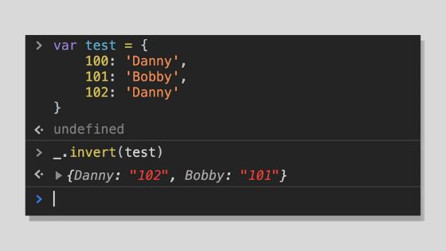
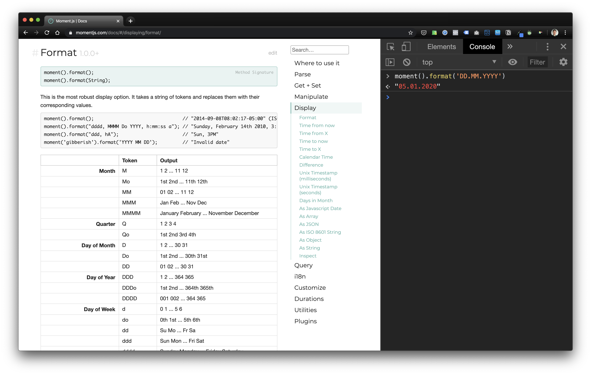

**Real software engineers don't reinvent libraries that already exist, they build something better on top of them.**

It is 2020 and I don't know a single software engineer who doesn't use third-party libraries in their work. Which makes sense. Why rewrite and maintain what has already been written and maintained?

But even though libraries are mostly free to use, they are not cost-free. One of the biggest costs, which applies to libraries developed by others _and_ those developed internally by someone in your company, is **time needed to learn to use it**.

Since using JavaScript libraries is part of the job of a developer, it only makes sense to know how to learn how to use them quickly.

The good news? Because of the nature of JavaScript on browsers, there is almost no barrier to rapidly try out new libraries and build an understanding of how to use them.

## Try new libraries via the Browser Console

The easiest and fastest way I know to get your hands dirty with a new library? The unassuming browser console.

Let's say that you need a method that will take any given object and reverse the key-value pairs.

You've checked [MDN docs](https://developer.mozilla.org/en-US/) and know that there is no built-in method in the JavaScript programming language. So you googled more generally for solutions, and in a Stackoverflow thread, you see someone mentioning something about the `invert` method in lodash. The example looks like it does exactly what you need.

At this point, you can try it for yourself in several ways before incorporating it into your code. From least to most effective:

- **Download the package**. Import the library, write some code, and run it via the command line
- **Create your own HTML file**. Add a `<script>` tag to load the library in the file, write some inline JavaScript, then open the HTML in your browser
- **Use it directly in the browser console**. Open the console and use the method via the global variable (eg. `_` for lodash, `moment` for Moment.js)

Using the third approach will save you a lot of time especially if, after testing the method, you realise that it doesn't do exactly what you need. You'd save time from running the package (un)install commands like `npm install` and deleting files you've created just for testing, to name a few things.

This works for almost all JavaScript libraries because their documentation pages would have already loaded the library on the front end so that example code snippets on their documentation website will load correctly.

In the examples below I use the Chrome developer tools' console tab to access the global variable on various libraries' documentation pages.

### Lodash library example

[Lodash](https://lodash.com/) is a popular library containing numerous handy methods that I've found very useful in day-to-day software development work. I think of it as basically an expansion package of the built-in JavaScript methods.

Load Lodash docs, open console, use the \`\_\` global variable for rapid testing!

### Moment.js library example

[Moment.js](https://momentjs.com/) is probably the most widely used library for manipulating and formatting date and time on both the front and back end.

Similary for Moment.js, you can rapidly test methods from the global \`moment\` variable loaded on the console

## Works for JavaScript built-in methods

I sometimes also use the browser console for testing built-in functions like `reduce` and [Web APIs](https://developer.mozilla.org/en-US/docs/Web/API) like `fetch` , especially when I'm in a quick and hacky mindset, trying to figure out if something is possible.

I used to do this a lot on something like [repl.it](https://www.nickang.com/silly-useful-things-repl/), which is also a REPL console like the browser developer tools' console but with more features like autocompletion and saving. At some point though, it occurred to me that it might be easier for some smaller testing to just do it in the browser console.

(In case you're wondering what REPL is, you can learn more in this post: [What is REPL?](https://www.nickang.com/what-is-repl/))

Just to be clear, unlike with third-party libraries where you have to test while you're on a page of its documentation website, you can test JavaScript built-in functions from the console of any webpage because they're built into the language itself.
