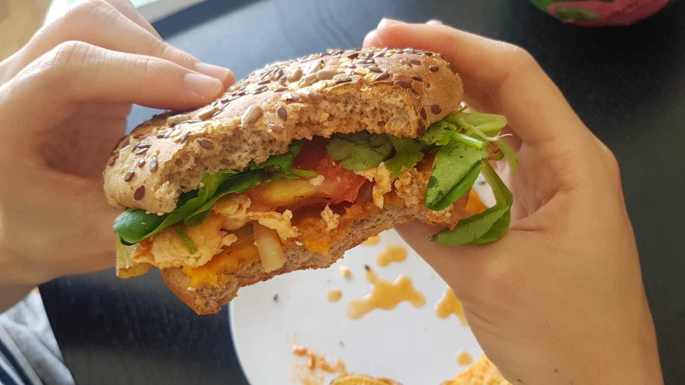
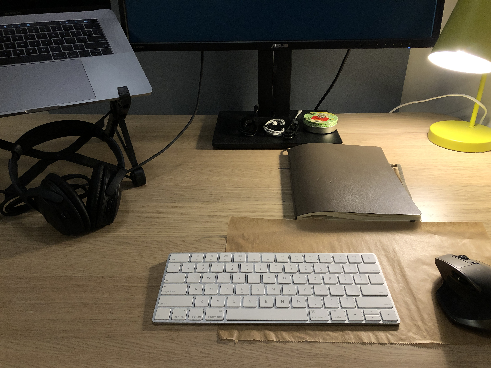

I like feedback. No, let me make that clearer: I *love* feedback. When I receive it, I’m presented with an opportunity to grow. When I give it, I in turn offer that opportunity to someone. Feedback makes us better people.

But it’s obvious to me that we live in a world where we don’t hear feedback as much as we could or should be. I think this is because we have it hard enough already without someone effectively telling us how we are kind of bad (i.e. suck) at something. That’s a shame.

This brings me what I ate at home for lunch today. My wife cooked something totally whacky and presented it to me as a “China burger”. I’ve never heard that term before and I am sure she just made that up.

*This is what it looked like.*

In case it’s not obvious from the picture, this burger contains very unusual ingredients (for a burger):

- Grilled onions
- Rucola salad veggies
- Coriander / parsley
- Stir-fried egg and tomato, Chinese style
- Cheddar cheese
- Multi-grain burger bread

I looked at this “China burger” and smiled to myself. Before I took my first bite, I had already known that I wanted to say something to my wife after I take that bite. **I knew I wanted to give her feedback because this burger is so whacky that I needed to say something about it to its creator!**

It turned out to be a really tasty burger by my (biased) standards, by the way. I told her that I honestly wouldn’t mind having it again.

This got me thinking: maybe we can all compel people to give us feedback if we just decided to courageously do whacky things more regularly.

A few other places I’ve seen this “whackiness compels feedback” phenomena:

- In a field journal for my final year undergraduate module, I wrote timestamps of *when* I started writing each entry. My professor gave me an A+ and wrote her feedback: “I *loved* the personal journal-style entries with the time stamps!”
- This person [@visakanv on Twitter](https://twitter.com/visakanv/status/1265188788914974720) sharing publicly his effort to doodle a picture of his own face using the "chaos shading", which is drawing with long, messy lines. He got a lot of feedback from his 20k followers

I think this is a thing, and I’m going to try and test it out. So here’s what I’m going to do.

For the next 30 posts on this blog, I will append an image of the place I was at when I first wrote the post at the end of the post. This is something I’ve wanted to try for a while. I partially tested this with a contextual by-line before, but that was just text (examples [1](/2018-08-12-all-the-peace-from-within), [2](/2018-08-11-cappuccino-people), [3](/2018-07-28-reflecting-on-1-month-of-being-vegetarian)). This time, I’m going with text and an image. It might affect page loading times but you know, at least it's _whack_.

---

_Writing at home at 10:00pm, at the end of a work day spent restructuring my team’s task backlog. Worked from home, because corona._

