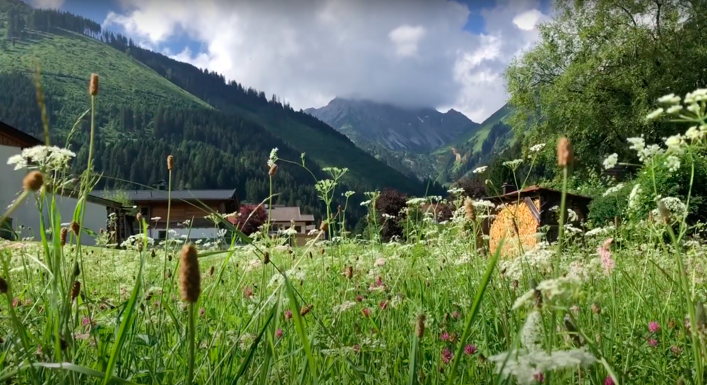
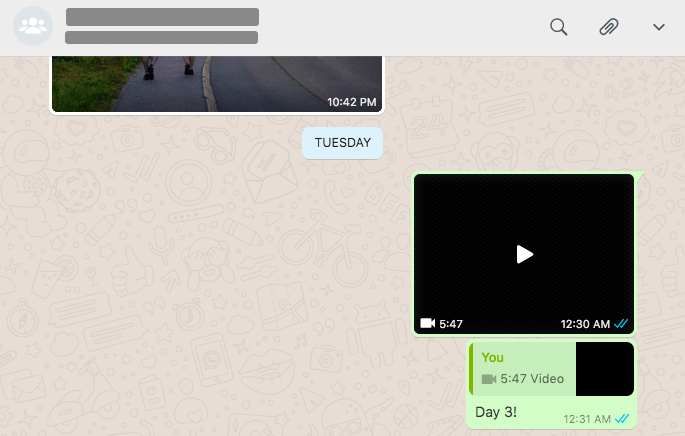

Reading, creating one film everyday during a vacation, and writing. What do these things have in common? Not much, but one thing that would make us do all these things more regularly and to do them better is to pursue them with a light touch.

For as long as I can remember, I've been fascinated by the grace of nature. When the hurricane sweeps through a town, the trees usually stay on the ground with minimal damage. For all of life's difficulties, nature seems to find a way to gracefully side step them or work with what they're presented. This is why I think there is merit in trying to go about our various pursuits in life with a similar lightness.

How does a tree stay rooted in the face of a hurricane? The roots play a part, sure, but what is also important is how the tree has evolved to be able to sway nimbly above ground, like dancing in the wind, without breaking too many twigs or losing too many leaves.

That is the magic of a light touch - you can have grand visions like a tree has in growing into a towering centennial, but at every step of the way you remind yourself to bend with the wind and work with what you’re presented.

This light touch might just be the only way to guarantee that we will get to partake in as many of our curious pursuits as possible until our cold end.

## Reading with a light touch

_For a period I only read when I had my iPad ready for sketching and typing notes..._

Back to the first of the three things I mentioned at the start of this article: reading. What does it mean to read with a light touch?

One way to read a book is to flip it open and just start reading with no plan in mind. Is this light? Yes, there can be no lighter approach. Is this effective? Well, if you're reading fiction, yes. But if you’re reading non-fiction, I would say no. Reading without writing notes is like taking 10 tablets of vitamin C in a day - once your body has absorbed its share for the day, the rest of the nutrients are discarded out your butthole.

I learned that this applies to reading several years ago but internalised it recently. I retain much more of what I read nowadays because I write notes and store them in my [personal knowledge management (PKM) system](/2020-07-05-personal-knowledge-management-system).

That said, my approach to writing notes when I read non-fiction (which is about 90 percent of my total reading time in the last few years) lacks a certain kind of lightness.

Case in point - it recently took me around 6 hours to read [Scott Berkun’s *The Year Without Pants*](/2020-07-26-notes-from-the-year-without-pants-by-scott-berkun/), a small book with 272 pages. To be precise, that's the total amount of time I had the Libby app open to the book. (Libby app is what I use to read borrowed e-books.) That's quite slow, considering what I mean by "writing notes" in this case is merely marginalia and highlighting, which means they are “off the top of my head” thoughts around passages of the book that I will need to process again a day or two later.

So, having a light touch when reading, to me, means reading lightly and not overthinking every paragraph for its significance. Ever since I became aware of the futility of reading without writing notes, I have become quite the enforcer of my own rule to always pay attention to everything in a book and annotate. I have begun to do this too well and reading has started to become a drag. I would open a book and read a couple of pages and stall because I was busy considering everything. It’s like overloading a computer’s RAM.

The idea that helps me read with a light touch is to trust that if something the author wrote is significant, my brain will detect it. As long as I stay attentive while reading, I won't need to over-analyse every passage. This idea is liberating, like jettisoning a big load that has been hunkering down my boat. Now I can speed up again and start skipping on water.

## Succeeding in creating a film a day with a light touch
Next, let’s talk about a tiny filmmaking project I recently undertook for fun.

My wife and I recently traveled to Bavaria (south of Germany) and Austria with two friends. I've been fascinated by the ability of film to help people relive memories ever since I watched [Casey Neistat’s first daily vlog](https://www.youtube.com/watch?v=gnHCw87Enq4), and I wanted to capture this trip for posterity. I also wanted to get better at storytelling through film as well as to get more proficient at working with movie editing software.

Before the trip, I had already made around 21 vlogs (published on [my YouTube channel](https://www.youtube.com/channel/UCfGK7NLYK22y1ahCh6w9baw/playlists?view_as=subscriber)) and each of those took many hours to cut, edit, render, and publish. Over the span of a year, I think I spent on average around 4 hours from the "cutting room floor" to having the video on YouTube. My daily vlogs in Ukraine for example took at least 2 hours every evening to create and publish, sometimes stretching past midnight. That experience vlogging in Ukraine helped me see that 2 hours was too long to be sustainable in future trips. I knew I had to cut it down to under an hour if I were to work on this project without resentment.

So I set myself a clear and simple goal: publish 1 video each day we were in Bavaria without spending more than an hour on creation. This restriction drove me to think of how to develop a light touch in digital filmmaking.

The first thing I thought of surprisingly worked: use the iMovie app on my iPhone!

That lightness in setup enabled me to create 4 videos in 4 days, each produced in an hour or less in the evening after a long day out exploring nature.

_You can tell I was in a hurry to finish under an hour because of the black video thumbnail!_

In line with having a light touch, I postponed publishing those completed videos to YouTube. Instead, when I completed each day’s video, I just shared them with my wife and two friends on WhatsApp and went to bed after that. I published all 4 videos a few days after we settled back in our apartment in Berlin.

## Writing with a light touch
Finally, on to my favourite topic - writing. What does writing with a light touch look like?

To me, approaching writing with a light touch is to have conviction that no matter what I'm writing and how hard I try, that first draft will always be a **shitty first draft**. That is the name of chapter in Anne Lamott's book *Bird by Bird*, by the way, and I find it one of the truest things said about the craft of writing.

So to me, writing with a light touch means high-speed translation of thoughts to written words without care for how things may come together later during the editing phase.

Also important is the keyword *may* - the second part of writing light is to be fine with occasionally discarding what I've written. If I think about it, throwing away what I’ve written is not a big deal at all, despite how my human sentimentality and possessiveness wants me to feel. If what is written is entirely bad, I throw it away and forget about it. And if there is a gem in the rough, I may write again from that point on.

I have mostly succeeded in approaching writing with a light touch, although I occasionally still overthink it. *What's the value of writing this? Will this de-value my other areas of work? Am I being grandiose to think my thoughts matter to anyone but me?*

What has helped me in this regard is having joined a writing support group. Anything that makes one socially accountable to publish at a cadence (e.g. it is once a week for me with my fellow [word rafters](/2020-06-28-word-rafting)) is capable of muffling even the loudest self-critical thoughts.

When in doubt, you are probably overthinking it. Pursue everything with a light touch and let the magic bring you forward!